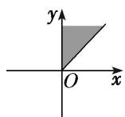
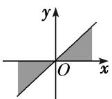
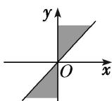
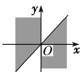

<!-- question-source:start -->
(1) 集合 $\left\{\alpha\mid k\pi\leq\alpha\leq k\pi+\frac{\pi}{4},\quad k\in Z\right\}$ 中的角所表示的范围(阴影部分)是()

A

B

C

D
<!-- question-source:end -->

![[高中/总复习/专题/三角函数/专题1 任意角、弧度制及任意角的三角函数-三角函数/考点01_角的概念/例题/answers/Q00042120A1.md]]
