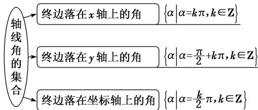

## 考点一 角的概念

【基本知识】

(1)定义: 角可以看成平面内一条射线绕着端点从一个位置旋转到另一个位置所成的图形.

正角：按顺时针方向旋转形成的角

按旋转方向不同分类.

负角：按逆时针方向旋转形成的角

(2)角的分类

零角：射线没有旋转

按终边位置不同分类.

象限角：角的终边在第几象限，这个角就是第几象限角

轴线角：角的终边落在坐标轴上

(3)终边相同的角：所有与角 $\alpha$ 终边相同的角，连同角 $\alpha$ 在内，构成的角的集合是 $S = \{\beta | \beta = k \cdot 360^\circ + \alpha, k \in \mathbf{Z}\}$ .

【例题选讲】

[例 1]
![[高中/总复习/专题/三角函数/专题1 任意角、弧度制及任意角的三角函数-三角函数/考点01_角的概念/例题/Q00042120.md]]
![[高中/总复习/专题/三角函数/专题1 任意角、弧度制及任意角的三角函数-三角函数/考点01_角的概念/例题/Q00042121.md]]
![[高中/总复习/专题/三角函数/专题1 任意角、弧度制及任意角的三角函数-三角函数/考点01_角的概念/例题/Q00042122.md]]
![[高中/总复习/专题/三角函数/专题1 任意角、弧度制及任意角的三角函数-三角函数/考点01_角的概念/例题/Q00042123.md]]
![[高中/总复习/专题/三角函数/专题1 任意角、弧度制及任意角的三角函数-三角函数/考点01_角的概念/例题/Q00042124.md]]
![[高中/总复习/专题/三角函数/专题1 任意角、弧度制及任意角的三角函数-三角函数/考点01_角的概念/例题/Q00042125.md]]
