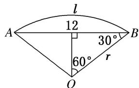

> [!faq]- 《专题1 任意角、弧度制及任意角的三角函数-三角函数》例题解析
>
> > [!success]- **【答案】** 详见解析
>
> > [!note]- **【解析】**
> > 答案 $\frac{8\sqrt{3}}{3}\pi$ 解析 设扇形的半径为 $r\mathrm{cm}$ ，如图．由 $\sin 60^{\circ} = \frac{\frac{12}{2}}{r}$ ，得 $r = 4\sqrt{3}$ ，又 $\alpha = \frac{2\pi}{3}$ ，所以 $l = |\alpha| \cdot r = \frac{2\pi}{3} \times 4\sqrt{3} = \frac{8\sqrt{3}}{3}\pi (\mathrm{cm})$
> >
> > 
