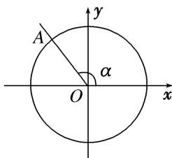

<!-- question-source:start -->
(1) 如图，在平面直角坐标系 xOy 中，角 $\alpha$ 的终边与单位圆交于点 A，点 A 的纵坐标为 $\frac{4}{5}$ ，则 $\cos \alpha$ 的值为（）

A. $\frac{4}{5}$ B. $-\frac{4}{5}$ C. $\frac{3}{5}$ D. $-\frac{3}{5}$
<!-- question-source:end -->

![[高中/总复习/专题/三角函数/专题1 任意角、弧度制及任意角的三角函数-三角函数/考点03_三角函数的定义及应用/例题/answers/Q00042132A1.md]]
