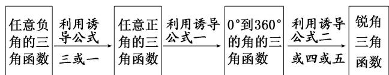

<!-- question-source:start -->
1. 利用诱导公式把任意角的三角函数转化为锐角三角函数的步骤

也就是：“负化正，大化小，化到锐角就好了”.

## 2. 明确三角函数式化简的原则和方向
<!-- question-source:end -->

![[高中/总复习/专题/三角函数/专题2 同角三角函数基本关系式及诱导公式-三角函数/考点02_诱导公式的应用/对点训练/answers/Q00042111A1.md]]
