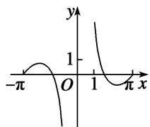
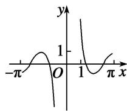

<!-- question-source:start -->
(5) 函数 $y=\frac{\sin2x}{1-\cos x}$ 的部分图象大致为()

A

B

C

D
<!-- question-source:end -->

![[高中/总复习/专题/三角函数/专题3   三角函数的图象与性质(1)-三角函数/考点01_三角函数的图象/例题/answers/Q00055942A1.md]]
