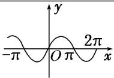
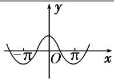
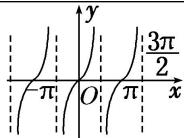

## 考点一 三角函数的图象

【基本知识】

<table><tr><td>三角函数</td><td>正弦函数 y=sin x</td><td>余弦函数 y=cos x</td><td>正切函数 y=tan x</td></tr><tr><td>图象</td><td></td><td></td><td></td></tr></table>

【例题选讲】

![[高中/总复习/专题/三角函数/专题3   三角函数的图象与性质(1)-三角函数/考点01_三角函数的图象/例题/Q00038881.md]]
