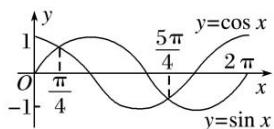

> [!faq]- 《专题3   三角函数的图象与性质(1)-三角函数》例题解析
>
> > [!success]- **【答案】** 详见解析
>
> > [!note]- **【解析】**
> > 答案 $\left[2k\pi + \frac{\pi}{4}, 2k\pi + \frac{5\pi}{4}\right](k \in \mathbf{Z})$ 解析 方法一 要使函数有意义, 必须使 $\sin x - \cos x \geq 0$ . 利用图象, 在同一坐标系中画出 $[0, 2\pi]$ 上 $y = \sin x$ 和 $y = \cos x$ 的图象, 如图所示.
> >
> > 
> >
> > 在 $[0, 2\pi]$ 内，满足 $\sin x = \cos x$ 的 $x$ 为 $\frac{\pi}{4}, \frac{5\pi}{4}$ ，再结合正弦、余弦函数的周期是 $2\pi$ ，所以原函数的定义域为 $\left\{x \mid 2k\pi + \frac{\pi}{4} \leq x \leq 2k\pi + \frac{5\pi}{4}, k \in \mathbf{Z} \right\}$ .
