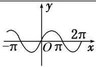
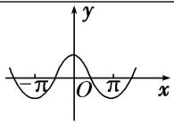
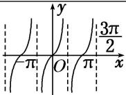

## 考点二 三角函数的定义域

【基本知识】

<table><tr><td>三角函数</td><td>正弦函数 $y = \sin x$ </td><td>余弦函数 $y = \cos x$ </td><td>正切函数 $y = \tan x$ </td></tr><tr><td>图象</td><td></td><td></td><td></td></tr><tr><td>定义域</td><td>R</td><td>R</td><td> $\left\{ x \mid x \in \mathbf{R}, \text{且} x \neq k\pi + \frac{\pi}{2}, k \in \mathbf{Z} \right\}$ </td></tr></table>

## 【方法总结】

## 三角函数定义域的求法

(1)以正切函数为例，应用正切函数 $y = \tan x$ 的定义域求函数 $y = A\tan (\omega x + \varphi)$ 的定义域转化为求解简单的三角不等式.

(2)求复杂函数的定义域转化为求解简单的三角不等式. 简单的三角不等式, 利用三角函数的图象求解.

![[高中/总复习/专题/三角函数/专题3   三角函数的图象与性质(1)-三角函数/考点02_三角函数的定义域/例题/Q00038882.md]]
