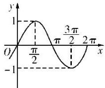
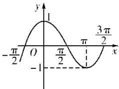
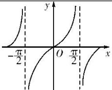

## 考点三 三角函数的值域(最值)

【基本知识】

<table><tr><td>三角函数</td><td>正弦函数 $y=\sin x$ </td><td>余弦函数 $y=\cos x$ </td><td>正切函数 $y=\tan x$ </td></tr><tr><td>图象</td><td></td><td></td><td></td></tr><tr><td>定义域</td><td>R</td><td>R</td><td> $\left\{ \begin{array}{c} x \mid x \in \mathbb{R}, \text{且 } x \neq k\pi + \frac{\pi}{2}, k \in \mathbb{Z} \end{array} \right\}$ </td></tr><tr><td>值域</td><td>[-1, 1]</td><td>[-1, 1]</td><td>R</td></tr><tr><td>最值</td><td>当且仅当 $x=\frac{\pi}{2}+2k\pi(k \in \mathbb{Z})$ 时,取得最大值1;当且仅当 $x=-\frac{\pi}{2}+2k\pi(k \in \mathbb{Z})$ 时,取得最小值-1</td><td>当且仅当 $x=2k\pi(k \in \mathbb{Z})$ 时,取得最大值1;当且仅当 $x=\pi+2k\pi(k \in \mathbb{Z})$ 时,取得最小值-1</td><td></td></tr></table>

## 【方法总结】

## 求三角函数的值域(最值)的 3 种类型及解法思路

(1)形如 $y=a\sin x+b\cos x+c$ 的三角函数化为 $y=A\sin(\omega x+\varphi)+k$ 的形式，再求值域(最值);

(2)形如 $y=a\sin^{2}x+b\sin x+c$ 的三角函数，可先设 $\sin x=t$ ，化为关于 t 的二次函数求值域(最值);

(3)形如 $y=a\sin x\cos x+b(\sin x\pm\cos x)+c$ 的三角函数，可先设 $t=\sin x\pm\cos x$ ，化为关于 t 的二次函数求值域(最值);

(4)对分式形式的三角函数表达式也可构造基本不等式求最值.

【例题选讲】

[例 3]
![[高中/总复习/专题/三角函数/专题3   三角函数的图象与性质(1)-三角函数/考点03_三角函数的值域_最值_/例题/Q00055949.md]]
![[高中/总复习/专题/三角函数/专题3   三角函数的图象与性质(1)-三角函数/考点03_三角函数的值域_最值_/例题/Q00055950.md]]
![[高中/总复习/专题/三角函数/专题3   三角函数的图象与性质(1)-三角函数/考点03_三角函数的值域_最值_/例题/Q00055951.md]]
![[高中/总复习/专题/三角函数/专题3   三角函数的图象与性质(1)-三角函数/考点03_三角函数的值域_最值_/例题/Q00055952.md]]
![[高中/总复习/专题/三角函数/专题3   三角函数的图象与性质(1)-三角函数/考点03_三角函数的值域_最值_/例题/Q00055953.md]]
![[高中/总复习/专题/三角函数/专题3   三角函数的图象与性质(1)-三角函数/考点03_三角函数的值域_最值_/对点训练/Q00038884.md]]
![[高中/总复习/专题/三角函数/专题3   三角函数的图象与性质(1)-三角函数/考点03_三角函数的值域_最值_/对点训练/Q00038885.md]]
![[高中/总复习/专题/三角函数/专题3   三角函数的图象与性质(1)-三角函数/考点03_三角函数的值域_最值_/对点训练/Q00038886.md]]
![[高中/总复习/专题/三角函数/专题3   三角函数的图象与性质(1)-三角函数/考点03_三角函数的值域_最值_/对点训练/Q00038887.md]]
![[高中/总复习/专题/三角函数/专题3   三角函数的图象与性质(1)-三角函数/考点03_三角函数的值域_最值_/对点训练/Q00038888.md]]
![[高中/总复习/专题/三角函数/专题3   三角函数的图象与性质(1)-三角函数/考点03_三角函数的值域_最值_/对点训练/Q00038889.md]]
![[高中/总复习/专题/三角函数/专题3   三角函数的图象与性质(1)-三角函数/考点03_三角函数的值域_最值_/对点训练/Q00038890.md]]
![[高中/总复习/专题/三角函数/专题3   三角函数的图象与性质(1)-三角函数/考点03_三角函数的值域_最值_/对点训练/Q00038891.md]]
![[高中/总复习/专题/三角函数/专题3   三角函数的图象与性质(1)-三角函数/考点03_三角函数的值域_最值_/对点训练/Q00038892.md]]
![[高中/总复习/专题/三角函数/专题3   三角函数的图象与性质(1)-三角函数/考点03_三角函数的值域_最值_/对点训练/Q00038893.md]]
![[高中/总复习/专题/三角函数/专题3   三角函数的图象与性质(1)-三角函数/考点03_三角函数的值域_最值_/对点训练/Q00038894.md]]
![[高中/总复习/专题/三角函数/专题3   三角函数的图象与性质(1)-三角函数/考点03_三角函数的值域_最值_/对点训练/Q00055954.md]]
![[高中/总复习/专题/三角函数/专题3   三角函数的图象与性质(1)-三角函数/考点03_三角函数的值域_最值_/对点训练/Q00038896.md]]
![[高中/总复习/专题/三角函数/专题3   三角函数的图象与性质(1)-三角函数/考点03_三角函数的值域_最值_/对点训练/Q00055955.md]]
