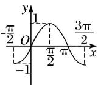
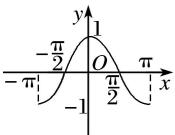
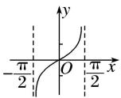

## 考点一 三角函数的奇偶性、周期性与对称性

## 【基本知识】

## 正弦、余弦、正切函数的图象与性质(下表中 $k \in Z$ )

<table><tr><td>函数</td><td> $y=\sin x$ </td><td> $y=\cos x$ </td><td> $y=\tan x$ </td></tr><tr><td>图象</td><td></td><td></td><td></td></tr><tr><td>定义域</td><td>R</td><td>R</td><td> $\{x|x\in R,且 x\neq k\pi+\frac{\pi}{2}\}$ </td></tr><tr><td>值域</td><td>[-1,1]</td><td>[-1,1]</td><td>R</td></tr><tr><td>周期性</td><td> $2\pi$ </td><td> $2\pi$ </td><td> $\pi$ </td></tr><tr><td>奇偶性</td><td>奇函数</td><td>偶函数</td><td>奇函数</td></tr><tr><td>对称中心</td><td> $(k\pi,0)$ </td><td> $\left(k\pi+\frac{\pi}{2},0\right)$ </td><td> $\left(\frac{k\pi}{2},0\right)$ </td></tr><tr><td>对称轴方程</td><td> $x=k\pi+\frac{\pi}{2}$ </td><td> $x=k\pi$ </td><td>无</td></tr></table>

## 【常用结论】

## 1. 三角函数的周期性

(1)函数 $y = A \sin (\omega x + \varphi)$ 的最小正周期 $T = \frac{2\pi}{|\omega|}$ . 应特别注意函数 $y = |A \sin (\omega x + \varphi)|$ 的周期为 $T = \frac{\pi}{|\omega|}$ ，函数 $y = |A \sin (\omega x + \varphi) + b| (b \neq 0)$ 的最小正周期 $T = \frac{2\pi}{|\omega|}$ .

(2)函数 $y=A\cos(\omega x+\varphi)$ 的最小正周期 $T=\frac{2\pi}{|\omega|}$ . 应特别注意函数 $y=|A\cos(\omega x+\varphi)|$ 的周期为 $T=\frac{\pi}{|\omega|}$ . 函数 $y=|A\cos(\omega x+\varphi)+b|(b\neq0)$ 的最小正周期均为 $T=\frac{2\pi}{|\omega|}$ .

(3)函数 $y = A \tan (\omega x + \varphi)$ 的最小正周期 $T = \frac{\pi}{|\omega|}$ . 应特别注意函数 $y = |A \tan (\omega x + \varphi)|$ 的周期为 $T = \frac{\pi}{|\omega|}$ , 函数 $y = |A \tan (\omega x + \varphi) + b| (b \neq 0)$ 的最小正周期均为 $T = \frac{\pi}{|\omega|}$ .

## 2. 三角函数的奇偶性

(1)函数 $y=A\sin(\omega x+\varphi)$ 是奇函数 $\Leftrightarrow\varphi=k\pi(k\in\mathbf{Z})$ ，是偶函数 $\Leftrightarrow\varphi=k\pi+\frac{\pi}{2}(k\in\mathbf{Z})$ ;

(2)函数 $y = A\cos (\omega x + \varphi)$ 是奇函数 $\Leftrightarrow \varphi = k\pi + \frac{\pi}{2} (k \in \mathbf{Z})$ ，是偶函数 $\Leftrightarrow \varphi = k\pi (k \in \mathbf{Z})$ ；

(3)函数 $y=A\tan(\omega x+\varphi)$ 是奇函数 $\Leftrightarrow\varphi=k\pi(k\in\mathbf{Z})$ .

## 3. 三角函数的对称性

(1)函数 $y=A\sin(\omega x+\varphi)$ 的图象的对称轴由 $\omega x+\varphi=k\pi+\frac{\pi}{2}(k\in\mathbf{Z})$ 解得，对称中心的横坐标由 $\omega x+\varphi=k\pi(k\in\mathbf{Z})$ 解得；

(2)函数 $y = A\cos (\omega x + \varphi)$ 的图象的对称轴由 $\omega x + \varphi = k\pi (k\in \mathbf{Z})$ 解得，对称中心的横坐标由 $\omega x + \varphi = k\pi + \frac{\pi}{2} (k\in \mathbf{Z})$ 解得；

(3)函数 $y = A \tan(\omega x + \varphi)$ 的图象的对称中心由 $\omega x + \varphi = \frac{k\pi}{2} (k \in \mathbf{Z})$ 解得.

## 【方法总结】

## 三角函数的奇偶性、周期性、对称性的处理方法

(1)若 $f(x) = A\sin (\omega x + \varphi)$ 为偶函数，则 $\varphi = k\pi +\frac{\pi}{2} (k\in \mathbf{Z})$ ，同时当 $x = 0$ 时， $f(x)$ 取得最大或最小值．若 $f(x)$ $= A\sin (\omega x + \varphi)$ 为奇函数，则 $\varphi = k\pi (k\in \mathbf{Z})$ ，且当 $x = 0$ 时， $f(x) = 0$

(2)求三角函数的最小正周期，一般先通过恒等变形化为 $y = A\sin (\omega x + \varphi), y = A\cos (\omega x + \varphi), y = A\tan (\omega x + \varphi)$ 的形式，再分别应用公式 $T = \frac{2\pi}{|\omega|}, T = \frac{2\pi}{|\omega|}, T = \frac{\pi}{|\omega|}$ 求解.

(3)对于函数 $y = A\sin (\omega x + \varphi)$ ，其对称轴一定经过图象的最高点或最低点，对称中心的横坐标一定是函数的零点，因此在判断直线 $x = x_0$ 或点 $(x_0, 0)$ 是否是函数的对称轴或对称中心时，可通过检验 $f(x_0)$ 的值进行判断.

## 【例题选讲】

[例1]
![[高中/总复习/专题/三角函数/专题3   三角函数的图象与性质(2)-三角函数/考点01_三角函数的奇偶性_周期性与对称性/例题/Q00055956.md]]
![[高中/总复习/专题/三角函数/专题3   三角函数的图象与性质(2)-三角函数/考点01_三角函数的奇偶性_周期性与对称性/例题/Q00055957.md]]
![[高中/总复习/专题/三角函数/专题3   三角函数的图象与性质(2)-三角函数/考点01_三角函数的奇偶性_周期性与对称性/例题/Q00055958.md]]
![[高中/总复习/专题/三角函数/专题3   三角函数的图象与性质(2)-三角函数/考点01_三角函数的奇偶性_周期性与对称性/例题/Q00055959.md]]
![[高中/总复习/专题/三角函数/专题3   三角函数的图象与性质(2)-三角函数/考点01_三角函数的奇偶性_周期性与对称性/例题/Q00055960.md]]
![[高中/总复习/专题/三角函数/专题3   三角函数的图象与性质(2)-三角函数/考点01_三角函数的奇偶性_周期性与对称性/例题/Q00055961.md]]
![[高中/总复习/专题/三角函数/专题3   三角函数的图象与性质(2)-三角函数/考点01_三角函数的奇偶性_周期性与对称性/例题/Q00055962.md]]
![[高中/总复习/专题/三角函数/专题3   三角函数的图象与性质(2)-三角函数/考点01_三角函数的奇偶性_周期性与对称性/例题/Q00055963.md]]
![[高中/总复习/专题/三角函数/专题3   三角函数的图象与性质(2)-三角函数/考点01_三角函数的奇偶性_周期性与对称性/对点训练/Q00038899.md]]
![[高中/总复习/专题/三角函数/专题3   三角函数的图象与性质(2)-三角函数/考点01_三角函数的奇偶性_周期性与对称性/对点训练/Q00038900.md]]
![[高中/总复习/专题/三角函数/专题3   三角函数的图象与性质(2)-三角函数/考点01_三角函数的奇偶性_周期性与对称性/对点训练/Q00038901.md]]
![[高中/总复习/专题/三角函数/专题3   三角函数的图象与性质(2)-三角函数/考点01_三角函数的奇偶性_周期性与对称性/对点训练/Q00038902.md]]
![[高中/总复习/专题/三角函数/专题3   三角函数的图象与性质(2)-三角函数/考点01_三角函数的奇偶性_周期性与对称性/对点训练/Q00038903.md]]
![[高中/总复习/专题/三角函数/专题3   三角函数的图象与性质(2)-三角函数/考点01_三角函数的奇偶性_周期性与对称性/对点训练/Q00038904.md]]
![[高中/总复习/专题/三角函数/专题3   三角函数的图象与性质(2)-三角函数/考点01_三角函数的奇偶性_周期性与对称性/对点训练/Q00038905.md]]
![[高中/总复习/专题/三角函数/专题3   三角函数的图象与性质(2)-三角函数/考点01_三角函数的奇偶性_周期性与对称性/对点训练/Q00038906.md]]
![[高中/总复习/专题/三角函数/专题3   三角函数的图象与性质(2)-三角函数/考点01_三角函数的奇偶性_周期性与对称性/对点训练/Q00038907.md]]
![[高中/总复习/专题/三角函数/专题3   三角函数的图象与性质(2)-三角函数/考点01_三角函数的奇偶性_周期性与对称性/对点训练/Q00038908.md]]
![[高中/总复习/专题/三角函数/专题3   三角函数的图象与性质(2)-三角函数/考点01_三角函数的奇偶性_周期性与对称性/对点训练/Q00038909.md]]
![[高中/总复习/专题/三角函数/专题3   三角函数的图象与性质(2)-三角函数/考点01_三角函数的奇偶性_周期性与对称性/对点训练/Q00038910.md]]
