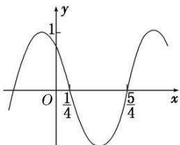

<!-- question-source:start -->
(5) (2015·全国I)函数 $f(x) = \cos (\omega x + \varphi)$ 的部分图象如图所示，则 $f(x)$ 的单调递减区间为()

A. $\left(k\pi-\frac{1}{4},\quad k\pi+\frac{3}{4}\right),\quad k\in\mathbf{Z}$ B. $\left(2k\pi-\frac{1}{4},\quad2k\pi+\frac{3}{4}\right),\quad k\in\mathbf{Z}$

C. $\left(k-\frac{1}{4},\quad k+\frac{3}{4}\right),\quad k\in\mathbf{Z}$ D. $\left(2k-\frac{1}{4},\quad 2k+\frac{3}{4}\right),\quad k\in\mathbf{Z}$
<!-- question-source:end -->

![[高中/总复习/专题/三角函数/专题3   三角函数的图象与性质(2)-三角函数/考点02_三角函数的单调性/例题/answers/Q00055968A1.md]]
