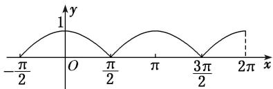

> [!faq]- 《专题3   三角函数的图象与性质(2)-三角函数》例题解析
>
> > [!success]- **【答案】** D
>
> > [!note]- **【解析】**
> > 答案 D 解析 将 $y = \cos x$ 的图象位于 $x$ 轴下方的部分关于 $x$ 轴对称向上翻折， $x$ 轴上方(或 $x$ 轴上)的部分不变，即得 $y = |\cos x|$ 的图象(如图). 故选 D.
> >
> > 
