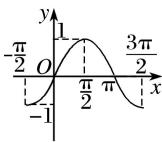
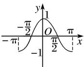
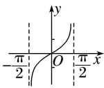

考点二 三角函数的单调性

【基本知识】

正弦、余弦、正切函数的图象与性质(下表中 $k \in \mathbf{Z}$ )

<table><tr><td>函数</td><td> $y=\sin x$ </td><td> $y=\cos x$ </td><td> $y=\tan x$ </td></tr><tr><td>图象</td><td></td><td></td><td></td></tr><tr><td>定义域</td><td>R</td><td>R</td><td> $\{x|x\in R, 且 x\neq k\pi+\frac{\pi}{2}\}$ </td></tr><tr><td>值域</td><td>[-1, 1]</td><td>[-1, 1]</td><td>R</td></tr><tr><td>周期性</td><td>2π</td><td>2π</td><td>π</td></tr><tr><td>奇偶性</td><td>奇函数</td><td>偶函数</td><td>奇函数</td></tr><tr><td>递增区间</td><td>[2kπ-π/2, 2kπ+π/2]</td><td>[2kπ-π, 2kπ]</td><td>(kπ-π/2, kπ+π/2)</td></tr><tr><td>递减区间</td><td>[2kπ+π/2, 2kπ+3π/2]</td><td>[2kπ, 2kπ+π]</td><td>无</td></tr><tr><td>对称中心</td><td>(kπ, 0)</td><td>(kπ+π/2, 0)</td><td>(kπ/2, 0)</td></tr><tr><td>对称轴方程</td><td>x=kπ+π/2</td><td>x=kπ</td><td>无</td></tr></table>

## 【常用结论】

(1)函数 $y = A \sin (\omega x + \varphi)(\omega > 0)$ 的单调递增区间由 $2k\pi - \frac{\pi}{2} \leq \omega x + \varphi \leq 2k\pi + \frac{\pi}{2} (k \in \mathbf{Z})$ 解得，单调递减区间由 $2k\pi + \frac{\pi}{2} \leq \omega x + \varphi \leq 2k\pi + \frac{3\pi}{2} (k \in \mathbf{Z})$ 解得.

(2)函数 $y = A\cos (\omega x + \varphi) (\omega > 0)$ 的单调递增区间由 $2k\pi - \pi \leq \omega x + \varphi \leq 2k\pi (k \in \mathbf{Z})$ 解得，单调递减区间由 $2k\pi \leq \omega x + \varphi \leq 2k\pi + \pi (k \in \mathbf{Z})$ 解得.

(3)函数 $y = A\tan (\omega x + \varphi) (\omega >0)$ 的单调递增区间由 $2k\pi -\frac{\pi}{2} < \omega x + \varphi < 2k\pi +\frac{\pi}{2} (k\in \mathbf{Z})$ 解得，

## 【方法总结】

## 三角函数单调性问题的常见类型及解题策略

(1)已知三角函数的解析式求单调区间的两种方法

①代换法：求形如 $y=A\sin(\omega x+\varphi)$ 或 $y=A\cos(\omega x+\varphi)$ (其中 $\omega>0$ ) 的单调区间时，要视“ $\omega x+\varphi$ ”为一个整体，通过解不等式求解．但如果 $\omega<0$ ，注意复合函数单调性“同增异减”的规律，防止把单调性弄错．

②图象法：画出三角函数的正、余弦曲线，结合图象求它的单调区间.

(2)已知三角函数的单调区间求参数的三种方法

①子集法：求出原函数的相应单调区间，由已知区间是所求某区间的子集，列不等式(组)求解.

②反子集法：由所给区间求出整体角的范围，由该范围是某相应正、余弦函数的某个单调区间的子集，列不等式(组)求解.

③周期性法：由所给区间的两个端点到其相应对称中心的距离不超过 $\frac{1}{4}$ 周期列不等式(组)求解.

若是选择题，利用特值验证排除法求解更为简捷.

## 【例题选讲】

[例 2]
![[高中/总复习/专题/三角函数/专题3   三角函数的图象与性质(2)-三角函数/考点02_三角函数的单调性/例题/Q00055964.md]]
![[高中/总复习/专题/三角函数/专题3   三角函数的图象与性质(2)-三角函数/考点02_三角函数的单调性/例题/Q00055965.md]]
![[高中/总复习/专题/三角函数/专题3   三角函数的图象与性质(2)-三角函数/考点02_三角函数的单调性/例题/Q00055966.md]]
![[高中/总复习/专题/三角函数/专题3   三角函数的图象与性质(2)-三角函数/考点02_三角函数的单调性/例题/Q00055967.md]]
![[高中/总复习/专题/三角函数/专题3   三角函数的图象与性质(2)-三角函数/考点02_三角函数的单调性/例题/Q00055968.md]]
![[高中/总复习/专题/三角函数/专题3   三角函数的图象与性质(2)-三角函数/考点02_三角函数的单调性/例题/Q00055969.md]]
![[高中/总复习/专题/三角函数/专题3   三角函数的图象与性质(2)-三角函数/考点02_三角函数的单调性/例题/Q00055970.md]]
![[高中/总复习/专题/三角函数/专题3   三角函数的图象与性质(2)-三角函数/考点02_三角函数的单调性/例题/Q00055971.md]]
![[高中/总复习/专题/三角函数/专题3   三角函数的图象与性质(2)-三角函数/考点02_三角函数的单调性/例题/Q00055972.md]]
![[高中/总复习/专题/三角函数/专题3   三角函数的图象与性质(2)-三角函数/考点02_三角函数的单调性/对点训练/Q00038913.md]]
![[高中/总复习/专题/三角函数/专题3   三角函数的图象与性质(2)-三角函数/考点02_三角函数的单调性/对点训练/Q00038914.md]]
![[高中/总复习/专题/三角函数/专题3   三角函数的图象与性质(2)-三角函数/考点02_三角函数的单调性/对点训练/Q00038915.md]]
![[高中/总复习/专题/三角函数/专题3   三角函数的图象与性质(2)-三角函数/考点02_三角函数的单调性/对点训练/Q00038916.md]]
![[高中/总复习/专题/三角函数/专题3   三角函数的图象与性质(2)-三角函数/考点02_三角函数的单调性/对点训练/Q00038917.md]]
![[高中/总复习/专题/三角函数/专题3   三角函数的图象与性质(2)-三角函数/考点02_三角函数的单调性/对点训练/Q00038918.md]]
![[高中/总复习/专题/三角函数/专题3   三角函数的图象与性质(2)-三角函数/考点02_三角函数的单调性/对点训练/Q00038919.md]]
![[高中/总复习/专题/三角函数/专题3   三角函数的图象与性质(2)-三角函数/考点02_三角函数的单调性/对点训练/Q00038920.md]]
![[高中/总复习/专题/三角函数/专题3   三角函数的图象与性质(2)-三角函数/考点02_三角函数的单调性/对点训练/Q00038921.md]]
![[高中/总复习/专题/三角函数/专题3   三角函数的图象与性质(2)-三角函数/考点02_三角函数的单调性/对点训练/Q00038922.md]]
![[高中/总复习/专题/三角函数/专题3   三角函数的图象与性质(2)-三角函数/考点02_三角函数的单调性/对点训练/Q00038923.md]]
![[高中/总复习/专题/三角函数/专题3   三角函数的图象与性质(2)-三角函数/考点02_三角函数的单调性/对点训练/Q00038924.md]]
![[高中/总复习/专题/三角函数/专题3   三角函数的图象与性质(2)-三角函数/考点02_三角函数的单调性/对点训练/Q00038925.md]]
![[高中/总复习/专题/三角函数/专题3   三角函数的图象与性质(2)-三角函数/考点02_三角函数的单调性/对点训练/Q00038926.md]]
![[高中/总复习/专题/三角函数/专题3   三角函数的图象与性质(2)-三角函数/考点02_三角函数的单调性/对点训练/Q00055973.md]]
![[高中/总复习/专题/三角函数/专题3   三角函数的图象与性质(2)-三角函数/考点02_三角函数的单调性/对点训练/Q00038928.md]]
![[高中/总复习/专题/三角函数/专题3   三角函数的图象与性质(2)-三角函数/考点02_三角函数的单调性/对点训练/Q00055974.md]]
![[高中/总复习/专题/三角函数/专题3   三角函数的图象与性质(2)-三角函数/考点02_三角函数的单调性/对点训练/Q00038930.md]]
![[高中/总复习/专题/三角函数/专题3   三角函数的图象与性质(2)-三角函数/考点02_三角函数的单调性/对点训练/Q00055975.md]]
![[高中/总复习/专题/三角函数/专题3   三角函数的图象与性质(2)-三角函数/考点02_三角函数的单调性/对点训练/Q00038932.md]]
![[高中/总复习/专题/三角函数/专题3   三角函数的图象与性质(2)-三角函数/考点02_三角函数的单调性/对点训练/Q00038933.md]]
