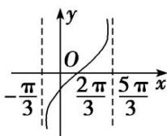
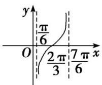
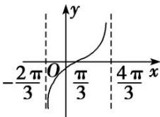
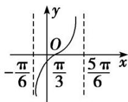

<!-- question-source:start -->
(4) 函数 $y = \tan \left( \frac{1}{2} x - \frac{\pi}{3} \right)$ 在一个周期内的图象是（）

A

B

C

D
<!-- question-source:end -->

![[高中/总复习/专题/三角函数/专题3 三角函数的图象与性质(1)-三角函数/考点01_三角函数的图象/例题/answers/Q00042143A1.md]]
