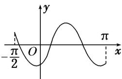
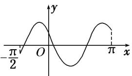
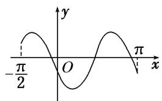
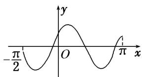
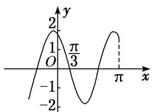
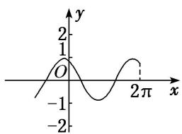
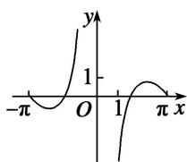
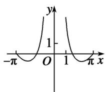

> [!faq]- 《专题3 三角函数的图象与性质(1)-三角函数》例题解析
>
> > [!success]- **【答案】** C
>
> > [!note]- **【分析】**
> > 本题未单列分析。
>
> > [!note]- **【解析】**
> > 答案 D 解析 函数 $y = \sin x^2$ 为偶函数，排除 A, C；又当 $x = \sqrt{\frac{\pi}{2}}$ 时函数取得最大值，排除 B，故选 D.
> > (2)函数 $y = \sin \left(2x - \frac{\pi}{3}\right)$ 在区间 $\left[-\frac{\pi}{2}, \pi\right]$ 上的简图是（）
> > 
> > A
> > 
> > B
> > 
> > C
> > 
> > D
> > 答案 A 解析 令 $x = 0$ ，得 $y = \sin \left(-\frac{\pi}{3}\right) = -\frac{\sqrt{3}}{2}$ ，排除B、D．由 $f\left(-\frac{\pi}{3}\right) = 0,f\left(\frac{\pi}{6}\right) = 0$ ，排除C，故选
> > A.
> > (3) 函数 $y=2\cos\left(2x+\frac{\pi}{6}\right)$ 的部分图象大致是()
> > 
> > A
> > 
> > B
> > 
> > C
> > 
> > D
> > 答案 A 解析 由 $y = 2\cos \left(2x + \frac{\pi}{6}\right)$ 可知，函数的最大值为 2，故排除 D；又因为函数图象过点 $\left(\frac{\pi}{6}, 0\right)$ ，故排除 B；又因为函数图象过点 $\left(-\frac{\pi}{12}, 2\right)$ ，故排除 C.
> > (4) 函数 $y = \tan \left( \frac{1}{2} x - \frac{\pi}{3} \right)$ 在一个周期内的图象是（）
> > 
> > A
> > 
> > B
> > 
> > 
> > C
> > D
> > 答案 A 解析 由题意得函数的周期为 $T = 2\pi$ ，故可排除 B，D. 对于 C，图象过点 $\left[\frac{\pi}{3}, 0\right]$ ，代入解析式，不成立，故选 A.
> > (5) 函数 $y=\frac{\sin2x}{1-\cos x}$ 的部分图象大致为()
> > 
> > A
> > 
> > B
> > 
> > C
> > 
> > D
> > 答案 C 解析 令 $f(x) = \frac{\sin 2x}{1 - \cos x}$ ， $\because f(1) = \frac{\sin 2}{1 - \cos 1} > 0, f(\pi) = \frac{\sin 2\pi}{1 - \cos \pi} = 0, \therefore$ 排除选项 A，D. 由 $1 - \cos x \neq 0$ ，得 $x \neq 2k\pi (k \in \mathbf{Z})$ ，故函数 $f(x)$ 的定义域关于原点对称．又 $\because f(-x) = \frac{\sin(-2x)}{1 - \cos(-x)} = -\frac{\sin 2x}{1 - \cos x} = -f(x)$ ， $\therefore f(x)$ 为奇函数，其图象关于原点对称， $\therefore$ 排除选项 B．
> >
> > 故选 **C**.
