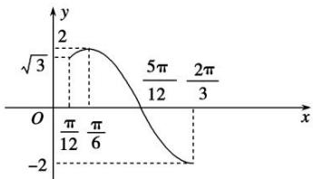

> [!faq]- 《专题3 三角函数的图象与性质(1)-三角函数》例题解析
>
> > [!success]- **【答案】** 详见解析
>
> > [!note]- **【解析】**
> > 答案 [1, $2\sqrt{2}$ ] 解析 由已知函数 $f(x)$ 的周期 $T=\pi$ ，区间 $[t, t+\frac{\pi}{4}]$ 的长度为 $\frac{T}{4}$ 。作出函数 $f(x)$ 在 $[\frac{\pi}{12}, \frac{2\pi}{3}]$ 的图象。
> >
> > 
> >
> > 又 $t \in [\frac{\pi}{12}, \frac{5\pi}{12}]$ ，则由图象可得，当 $x \in [\frac{\pi}{12}, \frac{\pi}{3}]$ 时， $h(t)$ 取最小值为 $f(\frac{\pi}{6}) - f(\frac{\pi}{3}) = 2 - 1 = 1$ ，当 $x \in [\frac{\pi}{6}, \frac{2\pi}{3}]$ 时，函数 $f(x)$ 为减函数，则 $h(t) = f(t) - f(t + \frac{\pi}{4}) = 2\sqrt{2}\sin(2t - \frac{\pi}{12})$ ，所以当 $t = \frac{7\pi}{24}$ 时， $h(t)$ 的最大值为 $2\sqrt{2}$ ，故所求值域为 $[1, 2\sqrt{2}]$ .
> >
> > 【对点训练】
