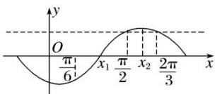

> [!faq]- 《专题3 三角函数的图象与性质(2)-三角函数》例题解析
>
> > [!success]- **【答案】** 详见解析
>
> > [!note]- **【解析】**
> > 答案 $\pi$ 解析 记 $f(x)$ 的最小正周期为 $T$ . 由题意知 $\frac{T}{2} \geq \frac{\pi}{2} - \frac{\pi}{6} = \frac{\pi}{3}$ , 又 $f\left(\frac{\pi}{2}\right) = f\left(\frac{2\pi}{3}\right) = -f\left(\frac{\pi}{6}\right)$ , 且 $\frac{2\pi}{3} - \frac{\pi}{2} = \frac{\pi}{6}$ , 可作出示意图如图所示(一种情况):
> >
> > 
> >
> > $\therefore x_{1} = \left(\frac{\pi}{2} +\frac{\pi}{6}\right)\times \frac{1}{2} = \frac{\pi}{3},x_{2} = \left(\frac{\pi}{2} +\frac{2\pi}{3}\right)\times \frac{1}{2} = \frac{7\pi}{12},\therefore \frac{T}{4} = x_{2} - x_{1} = \frac{7\pi}{12} -\frac{\pi}{3} = \frac{\pi}{4},\therefore T = \pi .$
