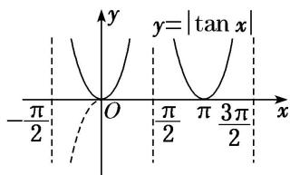

> [!faq]- 《专题3 三角函数的图象与性质(2)-三角函数》例题解析
>
> > [!success]- **【答案】** 详见解析
>
> > [!note]- **【解析】**
> > 答案 $\left[-\frac{\pi}{2}, 0\right], \left[\frac{\pi}{2}, \pi\right]$ 解析 作出 $y = |\tan x|$ 的示意图如图，观察图象可知， $y = |\tan x|$ 在 $\left[-\frac{\pi}{2}, \frac{3\pi}{2}\right]$ 上的单调递减区间为 $\left[-\frac{\pi}{2}, 0\right]$ 和 $\left[\frac{\pi}{2}, \pi\right]$ .
> >
> > 
