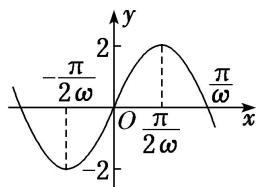

> [!faq]- 《专题3 三角函数的图象与性质(2)-三角函数》例题解析
>
> > [!success]- **【答案】** 详见解析
>
> > [!note]- **【分析】**
> > 本题未单列分析。
>
> > [!note]- **【解析】**
> > (9)若 $f(x)=2\sin\omega x(\omega>0)$ 在区间 $\left[-\frac{\pi}{2},\frac{2\pi}{3}\right]$ 上是增函数，则 $\omega$ 的取值范围是\_\_\_\_.
> > 答案 $0 < \omega \leq \frac{3}{4}$ 解析 法一：因为 $x \in \left[-\frac{\pi}{2}, \frac{2\pi}{3}\right] (\omega > 0)$ ，所以 $\omega x \in \left[-\frac{\pi\omega}{2}, \frac{2\pi\omega}{3}\right]$ ，因为 $f(x) = 2\sin \omega x$ 在 $\left[-\frac{\pi}{2}, \frac{2\pi}{3}\right]$ 上是增函数，所以 $\begin{cases} -\frac{\pi\omega}{2} \geq -\frac{\pi}{2}, \\ \frac{2\pi\omega}{3} \leq \frac{\pi}{2}, \\ \omega > 0, \end{cases}$ 故 $0 < \omega \leq \frac{3}{4}$ .
> > 法二：画出函数 $f(x) = 2\sin \omega x (\omega > 0)$ 的图象如图所示．要使 $f(x)$ 在 $\left[-\frac{\pi}{2}, \frac{2\pi}{3}\right]$ 上是增函数，需 $\begin{cases} -\frac{\pi}{2\omega} \leq -\frac{\pi}{2}, \\ \frac{2\pi}{3} \leq \frac{\pi}{2\omega}, \\ \omega > 0, \end{cases}$ 即 $0 < \omega \leq \frac{3}{4}$ .
> > 
> > (10) 已知 $\omega > 0$ ，函数 $f(x) = \sin \left(\frac{\omega x + \frac{\pi}{4}}{4}\right)$ 在 $\left(\frac{\pi}{2}, \pi\right)$ 上单调递减，则 $\omega$ 的取值范围是 \_\_\_\_.
> > 答案 $\left[\frac{1}{2},\frac{5}{4}\right]$ 解析 由 $\frac{\pi}{2} < x < \pi$ ， $\omega >0$ ，得 $\frac{\omega\pi}{2} +\frac{\pi}{4} < \omega x + \frac{\pi}{4} < \omega \pi +\frac{\pi}{4}$ ，又 $y = \sin x$ 的单调递减区间为 $\left[2k\pi +\frac{\pi}{2},2k\pi +\frac{3\pi}{2}\right],k\in \mathbf{Z}$ ，所以 $\left\{ \begin{array}{ll}\frac{\omega\pi}{2} +\frac{\pi}{4}\geq \frac{\pi}{2} +2k\pi ,\\ \omega \pi +\frac{\pi}{4}\leq \frac{3\pi}{2} +2k\pi , \end{array} \right.$ $k\in \mathbf{Z}$ ，解得 $4k + \frac{1}{2}\leq \omega \leq 2k + \frac{5}{4},k\in \mathbf{Z}$ .又由 $4k + \frac{1}{2}-$ $\left[2k + \frac{5}{4}\right]_{\leq 0},k\in \mathbf{Z}$ 且 $2k + \frac{5}{4} >0,k\in \mathbf{Z}$ ，得 $k = 0$ ，所以 $\omega \in \left[\frac{1}{2},\frac{5}{4}\right].$
> > 【对点训练】
