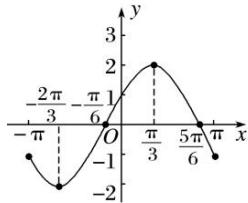

> [!faq]- 《专题3 三角函数的图象与性质(2)-三角函数》例题解析
>
> > [!success]- **【答案】** 详见解析
>
> > [!note]- **【分析】**
> > 本题未单列分析。
>
> > [!note]- **【解析】**
> > 解 (1) 因为点 $\left[-\frac{\pi}{6}, 0\right]$ 是函数 $f(x)$ 图象的一个对称中心，所以 $-\frac{\omega\pi}{3} + \frac{\pi}{6} = k\pi (k \in \mathbf{Z})$ ， $\omega = -3k + \frac{1}{2}(k \in \mathbf{Z})$ 因为 $0 < \omega < 1$ ，所以当 $k = 0$ 时，可得 $\omega = \frac{1}{2}$ 所以 $f(x) = 2\sin \left(x + \frac{\pi}{6}\right)$ . 令 $2k\pi - \frac{\pi}{2} \leq x + \frac{\pi}{6} \leq 2k\pi + \frac{\pi}{2} (k \in \mathbf{Z})$ ，解得 $2k\pi - \frac{2\pi}{3} \leq x \leq 2k\pi + \frac{\pi}{3} (k \in \mathbf{Z})$ 所以函数的单调递增区间为 $\left[2k\pi - \frac{2\pi}{3}, 2k\pi + \frac{\pi}{3}\right] (k \in \mathbf{Z})$
> > (2)由(1)知， $f(x)=2\sin\left(x+\frac{\pi}{6}\right)$ ， $x\in[-\pi,\pi]$
> > 列表如下:
> > <table><tr><td> $x+\frac{\pi}{6}$ </td><td> $-\frac{5\pi}{6}$ </td><td> $-\frac{\pi}{2}$ </td><td>0</td><td> $\frac{\pi}{2}$ </td><td> $\pi$ </td><td> $\frac{7\pi}{6}$ </td></tr><tr><td>x</td><td> $-\pi$ </td><td> $-\frac{2\pi}{3}$ </td><td> $-\frac{\pi}{6}$ </td><td> $\frac{\pi}{3}$ </td><td> $\frac{5\pi}{6}$ </td><td> $\pi$ </td></tr><tr><td> $f(x)$ </td><td>-1</td><td>-2</td><td>0</td><td>2</td><td>0</td><td>-1</td></tr></table>
> > 作出函数部分图象如图所示:
> > 
