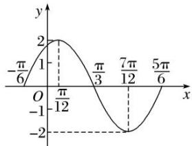

> [!faq]- 《专题4   函数y＝Asin(ωx＋φ)的图象-三角函数》例题解析
>
> > [!success]- **【答案】** 详见解析
>
> > [!note]- **【分析】**
> > 本题未单列分析。
>
> > [!note]- **【解析】**
> > (1)求它的振幅、周期、初相；
> > (2)用“五点法”作出它在一个周期内的图象;
> > (3)说明 $y = 2\sin \left(2x + \frac{\pi}{3}\right)$ 的图象可由 $y = \sin x$ 的图象经过怎样的变换而得到.
> > 解 $(1)y=2\sin\left(2x+\frac{\pi}{3}\right)$ 的振幅 A=2，周期 $T=\frac{2\pi}{2}=\pi$ ，初相 $\varphi=\frac{\pi}{3}$ .
> > (2)令 $X = 2x + \frac{\pi}{3}$ ，则 $y = 2\sin \left(2x + \frac{\pi}{3}\right) = 2\sin X$ 。列表如下：
> > <table><tr><td>x</td><td> $-\frac{\pi}{6}$ </td><td> $\frac{\pi}{12}$ </td><td> $\frac{\pi}{3}$ </td><td> $\frac{7\pi}{12}$ </td><td> $\frac{5\pi}{6}$ </td></tr><tr><td>X</td><td>0</td><td> $\frac{\pi}{2}$ </td><td> $\pi$ </td><td> $\frac{3\pi}{2}$ </td><td> $2\pi$ </td></tr><tr><td>y=sin X</td><td>0</td><td>1</td><td>0</td><td>-1</td><td>0</td></tr><tr><td>y=2sin $\left(2x+\frac{\pi}{3}\right)$ </td><td>0</td><td>2</td><td>0</td><td>-2</td><td>0</td></tr></table>
> > 描点画出图象，如图所示：
> > 
> > (3)方法一 把 $y = \sin x$ 的图象上所有的点向左平移 $\frac{\pi}{3}$ 个单位长度，得到 $y = \sin \left(\frac{x + \frac{\pi}{3}}{3}\right)$ 的图象；再把 $y = \sin \left(\frac{x + \frac{\pi}{3}}{3}\right)$ 的图象上所有点的横坐标缩短到原来的 $\frac{1}{2}$ 倍(纵坐标不变)，得到 $y = \sin \left(\frac{2x + \frac{\pi}{3}}{3}\right)$ 的图象；最后把 $y = \sin \left(\frac{2x + \frac{\pi}{3}}{3}\right)$ 上所有点的纵坐标伸长到原来的2倍(横坐标不变)，即可得到 $y = 2\sin \left(\frac{2x + \frac{\pi}{3}}{3}\right)$ 的图象.
> > 方法二 将 $y = \sin x$ 的图象上所有点的横坐标缩短为原来的 $\frac{1}{2}$ 倍(纵坐标不变)，得到 $y = \sin 2x$ 的图象；再将 $y = \sin 2x$ 的图象向左平移 $\frac{\pi}{6}$ 个单位长度，得到 $y = \sin \left[2\left(x + \frac{\pi}{6}\right)\right] = \sin \left(2x + \frac{\pi}{3}\right)$ 的图象；再将 $y = \sin \left(2x + \frac{\pi}{3}\right)$ 的图象上所有点的纵坐标伸长为原来的2倍(横坐标不变)，即得到 $y = 2\sin \left(2x + \frac{\pi}{3}\right)$ 的图象.
> > 【对点训练】
> > 1. 某同学用“五点法”画函数 $f(x) = A \sin (\omega x + \varphi) \left( \omega > 0, |\varphi| < \frac{\pi}{2} \right)$ 在某一个周期内的图象时，列表并填入了部分数据，如下表：
> > <table><tr><td> $\omega x + \varphi$ </td><td>0</td><td> $\frac{\pi}{2}$ </td><td> $\pi$ </td><td> $\frac{3\pi}{2}$ </td><td> $2\pi$ </td></tr><tr><td>x</td><td></td><td> $\frac{\pi}{3}$ </td><td></td><td> $\frac{5\pi}{6}$ </td><td></td></tr><tr><td> $A\sin(\omega x + \varphi)$ </td><td>0</td><td>5</td><td></td><td>-5</td><td>0</td></tr></table>
> > (1)请将上表数据补充完整，并直接写出函数 $f(x)$ 的解析式；
> > (2)将 $y = f(x)$ 图象上所有点向左平移 $\frac{\pi}{6}$ 个单位长度，得到 $y = g(x)$ 的图象，求 $y = g(x)$ 的图象离原点 $O$ 最近的对称中心；
> > (3)说明函数 $f(x)$ 的图象是由 $y=\sin x$ 的图象经过怎样的变换得到的.
