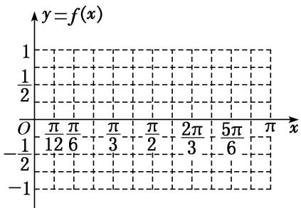

> [!faq]- 《专题4   函数y＝Asin(ωx＋φ)的图象-三角函数》例题解析
>
> > [!success]- **【答案】** 详见解析
>
> > [!note]- **【分析】**
> > 本题未单列分析。
>
> > [!note]- **【解析】**
> > (1)求 $\omega$ 和 $\varphi$ 的值；
> > (2)在给定坐标系中作出函数 $f(x)$ 在 $[0, \pi]$ 上的图象.
> > 
