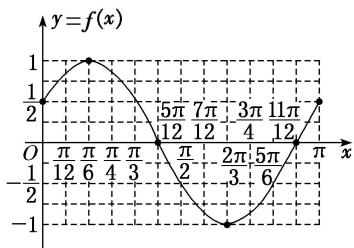

> [!faq]- 《专题4   函数y＝Asin(ωx＋φ)的图象-三角函数》例题解析
>
> > [!success]- **【答案】** 详见解析
>
> > [!note]- **【分析】**
> > 本题未单列分析。
>
> > [!note]- **【解析】**
> > 解 (1) 因为 $T = \frac{2\pi}{\omega} = \pi$ ，所以 $\omega = 2$ ，又因为 $f\left(\frac{\pi}{4}\right) = \cos\left(2 \times \frac{\pi}{4} + \varphi\right) = \cos\left(\frac{\pi}{2} + \varphi\right) = -\sin \varphi = \frac{\sqrt{3}}{2}$ 且 $-\frac{\pi}{2} < \varphi < 0$ ，所以 $\varphi = -\frac{\pi}{3}$ .
> > (2)由(1)知 $f(x)=\cos\left(2x-\frac{\pi}{3}\right)$ .
> > 列表：
> > <table><tr><td> $2x - \frac{\pi}{3}$ </td><td> $-\frac{\pi}{3}$ </td><td>0</td><td> $\frac{\pi}{2}$ </td><td> $\pi$ </td><td> $\frac{3\pi}{2}$ </td><td> $\frac{5\pi}{3}$ </td></tr><tr><td> $x$ </td><td>0</td><td> $\frac{\pi}{6}$ </td><td> $\frac{5\pi}{12}$ </td><td> $\frac{2\pi}{3}$ </td><td> $\frac{11\pi}{12}$ </td><td> $\pi$ </td></tr><tr><td> $f(x)$ </td><td> $\frac{1}{2}$ </td><td>1</td><td>0</td><td>-1</td><td>0</td><td> $\frac{1}{2}$ </td></tr></table>
> > 描点，连线，可得函数 $f(x)$ 在 $[0, \pi]$ 上的图象如图所示.
> > 
