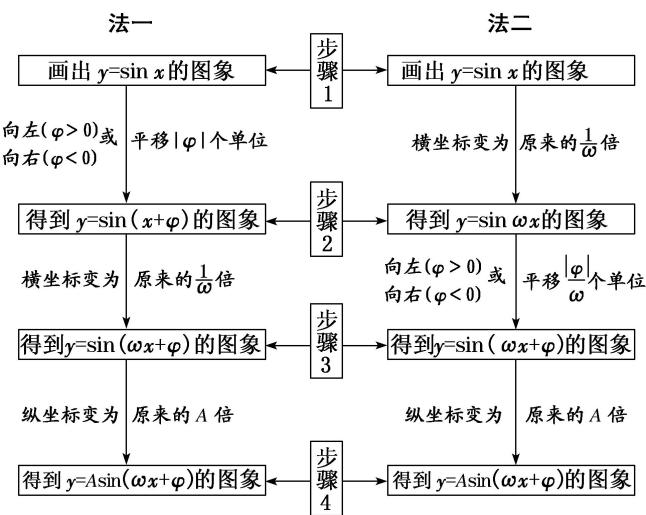

## 考点二 函数 $y = A\sin (\omega x + \varphi)$ 的图象的变换

## 【基本知识】

函数 $y=\sin x$ 的图象经变换得到 $y=A\sin(\omega x+\varphi)(A>0,\quad\omega>0)$ 的图象的两种途径

##
(1)两种变换的区别

①先相位变换(横向平移)再周期变换(伸缩变换)，平移的量是 $|\varphi|$ 个单位长度；②先周期变换(伸缩变换)再相位变换(横向平移)，平移的量是 $\frac{|\varphi|}{\omega}(\omega>0)$ 个单位长度.

##
(2)变换的注意点

无论哪种横向变换，每一个变换总是针对自变量 $x$ 而言的，即图象变换要看“自变量 $x$ ”发生多大变化，而不是看角“ $\omega x + \varphi$ ”的变化。即函数 $f(x) = \sin (\omega x + \varphi)$ 的图象向左(右)平移 $k$ 个单位长度后，其图象对应的函数解析式为 $g(x) = \sin [\omega (x \pm k) + \varphi]$ ，而不是 $g(x) = \sin (\omega x \pm k + \varphi)$ 。

## 【方法总结】

## 三角函数图象变换中的 3 个注意点

(1)变换前后，函数的名称要一致，若不一致，应先利用诱导公式转化为同名函数；

(2)要弄清变换的方向，即变换的是哪个函数的图象，得到的是哪个函数的图象，切不可弄错方向；

(3)要弄准变换量的大小，特别是平移变换中，函数 $y = A\sin x$ 到 $y = A\sin (x + \varphi)$ 的变换量是 $|\varphi|$ 个单位，而函数 $y = A\sin \omega x$ 到 $y = A\sin (\omega x + \varphi)$ 时，变换量是 $\left|\frac{\varphi}{\omega}\right|$ 个单位.

## 【例题选讲】

[例 2]
![[高中/总复习/专题/三角函数/专题4   函数y＝Asin(ωx＋φ)的图象-三角函数/考点02_函数__y___A_sin___omega_x____varphi___的图象的变换/例题/Q00042179.md]]
![[高中/总复习/专题/三角函数/专题4   函数y＝Asin(ωx＋φ)的图象-三角函数/考点02_函数__y___A_sin___omega_x____varphi___的图象的变换/例题/Q00042180.md]]
![[高中/总复习/专题/三角函数/专题4   函数y＝Asin(ωx＋φ)的图象-三角函数/考点02_函数__y___A_sin___omega_x____varphi___的图象的变换/例题/Q00042181.md]]
![[高中/总复习/专题/三角函数/专题4   函数y＝Asin(ωx＋φ)的图象-三角函数/考点02_函数__y___A_sin___omega_x____varphi___的图象的变换/例题/Q00042182.md]]
![[高中/总复习/专题/三角函数/专题4   函数y＝Asin(ωx＋φ)的图象-三角函数/考点02_函数__y___A_sin___omega_x____varphi___的图象的变换/例题/Q00042183.md]]
![[高中/总复习/专题/三角函数/专题4   函数y＝Asin(ωx＋φ)的图象-三角函数/考点02_函数__y___A_sin___omega_x____varphi___的图象的变换/例题/Q00042184.md]]
![[高中/总复习/专题/三角函数/专题4   函数y＝Asin(ωx＋φ)的图象-三角函数/考点02_函数__y___A_sin___omega_x____varphi___的图象的变换/对点训练/Q00038939.md]]
![[高中/总复习/专题/三角函数/专题4   函数y＝Asin(ωx＋φ)的图象-三角函数/考点02_函数__y___A_sin___omega_x____varphi___的图象的变换/对点训练/Q00038940.md]]
![[高中/总复习/专题/三角函数/专题4   函数y＝Asin(ωx＋φ)的图象-三角函数/考点02_函数__y___A_sin___omega_x____varphi___的图象的变换/对点训练/Q00038941.md]]
![[高中/总复习/专题/三角函数/专题4   函数y＝Asin(ωx＋φ)的图象-三角函数/考点02_函数__y___A_sin___omega_x____varphi___的图象的变换/对点训练/Q00038942.md]]
![[高中/总复习/专题/三角函数/专题4   函数y＝Asin(ωx＋φ)的图象-三角函数/考点02_函数__y___A_sin___omega_x____varphi___的图象的变换/对点训练/Q00038943.md]]
![[高中/总复习/专题/三角函数/专题4   函数y＝Asin(ωx＋φ)的图象-三角函数/考点02_函数__y___A_sin___omega_x____varphi___的图象的变换/对点训练/Q00038944.md]]
![[高中/总复习/专题/三角函数/专题4   函数y＝Asin(ωx＋φ)的图象-三角函数/考点02_函数__y___A_sin___omega_x____varphi___的图象的变换/对点训练/Q00038945.md]]
![[高中/总复习/专题/三角函数/专题4   函数y＝Asin(ωx＋φ)的图象-三角函数/考点02_函数__y___A_sin___omega_x____varphi___的图象的变换/对点训练/Q00038946.md]]
![[高中/总复习/专题/三角函数/专题4   函数y＝Asin(ωx＋φ)的图象-三角函数/考点02_函数__y___A_sin___omega_x____varphi___的图象的变换/对点训练/Q00038947.md]]
![[高中/总复习/专题/三角函数/专题4   函数y＝Asin(ωx＋φ)的图象-三角函数/考点02_函数__y___A_sin___omega_x____varphi___的图象的变换/对点训练/Q00038948.md]]
![[高中/总复习/专题/三角函数/专题4   函数y＝Asin(ωx＋φ)的图象-三角函数/考点02_函数__y___A_sin___omega_x____varphi___的图象的变换/对点训练/Q00038949.md]]
![[高中/总复习/专题/三角函数/专题4   函数y＝Asin(ωx＋φ)的图象-三角函数/考点02_函数__y___A_sin___omega_x____varphi___的图象的变换/对点训练/Q00038950.md]]
