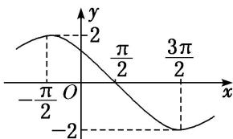

<!-- question-source:start -->
(1) 已知函数 $f(x)=A\sin(\omega x+\varphi)(A>0,\quad\omega>0,\quad0<\varphi<\pi)$ ，其部分图象如图所示，则函数 $f(x)$ 的解析式为()

A. $f(x)=2\sin\left(\frac{1}{2}x+\frac{\pi}{4}\right)$ B. $f(x)=2\sin\left(\frac{1}{2}x+\frac{3\pi}{4}\right)$ C. $f(x)=2\sin\left(\frac{1}{4}x+\frac{3\pi}{4}\right)$ D. $f(x)=2\sin\left(2x+\frac{\pi}{4}\right)$
<!-- question-source:end -->

![[高中/总复习/专题/三角函数/专题4   函数y＝Asin(ωx＋φ)的图象-三角函数/考点03_由图象确定__y___A__sin___omega_x____varphi___的解析式/例题/answers/Q00042185A1.md]]
