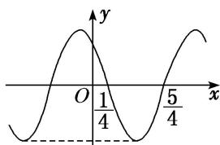

> [!faq]- 《专题4   函数y＝Asin(ωx＋φ)的图象-三角函数》例题解析
>
> > [!success]- **【答案】** C
>
> > [!note]- **【分析】**
> > 本题未单列分析。
>
> > [!note]- **【解析】**
> > 答案 B 解析 由题图可知 $A = 2$ ， $T = 2 \times \left[\frac{3\pi}{2} - \left(-\frac{\pi}{2}\right)\right] = 4\pi$ ，故 $\frac{2\pi}{\omega} = 4\pi$ ，解得 $\omega = \frac{1}{2}$ 。所以 $f(x) = 2\sin \left(\frac{1}{2} x + \varphi\right)$ 。把点 $\left(-\frac{\pi}{2}, 2\right)$ 代入可得 $2\sin \left[\frac{1}{2} \times \left(-\frac{\pi}{2}\right) + \varphi\right] = 2$ ，即 $\sin \left(\varphi - \frac{\pi}{4}\right) = 1$ ，所以 $\varphi - \frac{\pi}{4} = 2k\pi + \frac{\pi}{2}(k \in \mathbf{Z})$ ，解得 $\varphi = 2k\pi + \frac{3\pi}{4} (k \in \mathbf{Z})$ 。又 $0 < \varphi < \pi$ ，所以 $\varphi = \frac{3\pi}{4}$ 。所以 $f(x) = 2\sin \left(\frac{1}{2} x + \frac{3\pi}{4}\right)$ 。
> > (2) 函数 $f(x) = A \sin (\omega x + \varphi) \left\{ A > 0, \quad \omega > 0, \quad |\varphi| < \frac{\pi}{2} \right\}$ 的部分图象如图所示，则 $f\left(\frac{11\pi}{24}\right)$ 的值为（）
> > 
> > A. $-\frac{\sqrt{6}}{2}$ B. $-\frac{\sqrt{3}}{2}$ C. $-\frac{\sqrt{2}}{2}$ D. $-1$
> > 答案 D 解析 由图象可得 $A = \sqrt{2}$ ，最小正周期 $T = 4 \times \left(\frac{7\pi}{12} - \frac{\pi}{3}\right) = \pi$ ，则 $\omega = \frac{2\pi}{T} = 2$ 。由 $f\left(\frac{7\pi}{12}\right) =$ $\sqrt{2}\sin \left(\frac{7\pi}{6} +\varphi\right) = -\sqrt{2},|\varphi | <   \frac{\pi}{2}$ ，得 $\varphi = \frac{\pi}{3}$ ，则 $f(x) = \sqrt{2}\sin \left(2x + \frac{\pi}{3}\right)$ ，所以 $f\left(\frac{11\pi}{24}\right) = \sqrt{2}\sin \left(\frac{11\pi}{12} +\frac{\pi}{3}\right) = \sqrt{2}\sin \frac{5\pi}{4} = -1.$ (3）已知函数 $f(x) = \sin (\omega x + \varphi)\left[\omega >0, - \frac{\pi}{2} \leq \varphi \leq \frac{\pi}{2}\right]$ 的图象上的一个最高点和它相邻的一个最低点的距离为 $2\sqrt{2}$ ，且过点 $\left(2, - \frac{1}{2}\right)$ ，则函数 $f(x) =$ \_\_\_\_.答案 $\sin \left(\frac{\pi}{2} x + \frac{\pi}{6}\right)$ 解析依题意得 $\sqrt{2^2 + \left(\frac{\pi}{\omega}\right)^2} = 2\sqrt{2}$ ，则 $\frac{\pi}{\omega} = 2$ ，即 $\omega = \frac{\pi}{2}$ 所以 $f(x) = \sin \left(\frac{\pi}{2} x + \varphi\right)$ ，由于该函数图象过点 $\left(2, - \frac{1}{2}\right)$ 因此 $\sin (\pi +\varphi) = -\frac{1}{2}$ 即 $\sin \varphi = \frac{1}{2}$ 而 $-\frac{\pi}{2}\leq \varphi \leq \frac{\pi}{2}$ 故 $\varphi = \frac{\pi}{6}$ 所以 $f(x) = \sin \left(\frac{\pi}{2} x + \frac{\pi}{6}\right)$ (4）将函数 $f(x)$ 的图象上所有点向右平移个单位长度，得到函数 $g(x)$ 的图象．若函数 $g(x) = A\sin (\omega x+$ $\varphi)(A > 0,\omega >0,|\varphi |\leq \frac{\pi}{2})$ 的部分图象如图所示，则函数 $f(x)$ 的解析式为（）
> > 
> > A. $f(x) = \sin \left( x + \frac{5\pi}{12} \right)$ B. $f(x) = -\cos \left( 2x + \frac{\pi}{3} \right)$ C. $f(x) = \cos \left( 2x + \frac{\pi}{3} \right)$ D. $f(x) = \sin \left( 2x + \frac{7\pi}{12} \right)$
> > 答案 C 解析 法一：根据函数 $g(x)$ 的图象可知 A=1， $\frac{1}{2}T=\frac{\pi}{3}+\frac{\pi}{6}=\frac{\pi}{2}$ ， $T=\pi=\frac{2\pi}{\omega}$ ， $\omega=2$ ，所以 $g(x)=\sin(2x+\varphi)$ ，所以 $g\left(\frac{\pi}{3}\right)=\sin\left(\frac{2\pi}{3}+\varphi\right)=0$ ，所以 $\frac{2\pi}{3}+\varphi=\pi+k\pi$ ， $k\in Z$ ， $\varphi=\frac{\pi}{3}+k\pi$ ， $k\in Z$ ，又因为 $|\varphi|<\frac{\pi}{2}$ ，所以 $\varphi=\frac{\pi}{3}$ ，所以 $g(x)=\sin\left(2x+\frac{\pi}{3}\right)$ ，将 $g(x)=\sin\left(2x+\frac{\pi}{3}\right)$ 的图象向左平移 $\frac{\pi}{4}$ 个单位长度后，即可得到函数 $f(x)$ 的图象，所以函数 $f(x)$ 的解析式为 $f(x)=g\left(x+\frac{\pi}{4}\right)=\sin\left[2\left(x+\frac{\pi}{4}\right)+\frac{\pi}{3}\right]=\sin\left(\frac{\pi}{2}+2x+\frac{\pi}{3}\right)=\cos\left(2x+\frac{\pi}{3}\right)$ .
> > 法二：根据 $g(x)$ 的图象可知 $g\left(\frac{\frac{\pi}{3}-\frac{\pi}{6}}{2}\right)=g\left(\frac{\pi}{12}\right)=1$ ，因为 $f(x)$ 的图象向右平移 $\frac{\pi}{4}$ 个单位长度后，即可得到 $g(x)$ 的图象，所以 $f\left(\frac{\pi}{12}-\frac{\pi}{4}\right)=f\left(-\frac{\pi}{6}\right)=1$ ，对于 A， $f\left(-\frac{\pi}{6}\right)=\sin\frac{\pi}{4} \neq 1$ ，不符合题意；对于 B， $f\left(-\frac{\pi}{6}\right)=-\cos 0=-1 \neq 1$ ，不符合题意；对于 C， $f\left(-\frac{\pi}{6}\right)=\cos 0=1$ ，符合题意；对于 D， $f\left(-\frac{\pi}{6}\right)=\sin\frac{\pi}{4} \neq 1$ ，不符合题意.
> > (5) 函数 $f(x) = A \cos (\omega x + \varphi) (\omega > 0)$ 的部分图象如图所示，给出以下结论：
> > 
> > - **①**：$f(x)$ 的最小正周期为2；
> > - **②**：$f(x)$ 图象的一条对称轴为直线 $x=-\frac{1}{2}$ ；
> > - **③**：$f(x)$ 在 $\left(2k-\frac{1}{4},2k+\frac{3}{4}\right)$ ， $k\in Z$ 上是减函数；
> > - **④**：$f(x)$ 的最大值为A.
> > 则正确结论的个数为( )
> > A. 1    B. 2    C. 3    D. 4
> > 答案 B 解析 由题图可知，函数 $f(x)$ 的最小正周期 $T = 2 \times \left( \frac{5}{4} - \frac{1}{4} \right) = 2$ ，故①正确；因为函数 $f(x)$ 的图象过点 $\left( \frac{1}{4}, 0 \right)$ 和 $\left( \frac{5}{4}, 0 \right)$ ，所以函数 $f(x)$ 图象的对称轴为直线 $x = \frac{1}{2} \left( \frac{1}{4} + \frac{5}{4} \right) + \frac{kT}{2} = \frac{3}{4} + k (k \in \mathbf{Z})$ ，故直线 $x = -\frac{1}{2}$ 不是函数 $f(x)$ 图象的对称轴，故②不正确；由图可知，当 $\frac{1}{4} - \frac{T}{4} + kT \leq x \leq \frac{1}{4} + \frac{T}{4} + kT (k \in \mathbf{Z})$ ，即 $2k - \frac{1}{4} \leq x \leq 2k + \frac{3}{4} (k \in \mathbf{Z})$ 时， $f(x)$ 是减函数，故③正确；若 $A > 0$ ，则最大值是 $A$ ，若 $A < 0$ ，则最大值是 $-A$ ，故④不正确。综上知正确结论的个数为 2.
> > (6) 函数 $f(x) = A \sin (\omega x + \varphi) A > 0, \omega > 0, |\varphi| < \frac{\pi}{2}$ 的部分图象如图所示，若 $x_1, x_2 \in \left(-\frac{\pi}{6}, \frac{\pi}{3}\right)$ ，且 $f(x_1) = f(x_2)$ ，则 $f(x_1 + x_2) =$ \_\_\_\_.
> > 
> > 答案 $\frac{\sqrt{3}}{2}$ 解析 观察图象可知， $A = 1, T = 2\left[\frac{\pi}{3} - \left(-\frac{\pi}{6}\right)\right] = \pi, \therefore \omega = 2, \therefore f(x) = \sin(2x + \varphi)$ . 将 $\left[-\frac{\pi}{6}, 0\right]$ 代入上式得 $\sin\left(-\frac{\pi}{3} + \varphi\right) = 0$ ，即 $-\frac{\pi}{3} + \varphi = k\pi, k \in \mathbb{Z}$ ，由 $|\varphi| < \frac{\pi}{2}$ ，得 $\varphi = \frac{\pi}{3}$ ，则 $f(x) = \sin\left(2x + \frac{\pi}{3}\right)$ . 函数图象的对称轴为 $x = \frac{-\frac{\pi}{6} + \frac{\pi}{3}}{2} = \frac{\pi}{12}$ . 又 $x_1, x_2 \in \left(-\frac{\pi}{6}, \frac{\pi}{3}\right)$ ，且 $f(x_1) = f(x_2), \therefore \frac{x_1 + x_2}{2} = \frac{\pi}{12}$ ，即 $x_1 + x_2 = \frac{\pi}{6}, \therefore f(x_1 + x_2) = \sin\left(2 \times \frac{\pi}{6} + \frac{\pi}{3}\right) = \frac{\sqrt{3}}{2}$ .
> > (7) (2019·天津) 已知函数 $f(x) = A \sin (\omega x + \varphi) (A > 0, \omega > 0, |\varphi| < \pi)$ 是奇函数，且 $f(x)$ 的最小正周期为 $\pi$ ，将 $y = f(x)$ 的图象上所有点的横坐标伸长到原来的 2 倍 (纵坐标不变)，所得图象对应的函数为 $g(x)$ . 若 $g\left(\frac{\pi}{4}\right) = \sqrt{2}$ ,则 $f\left(\frac{3\pi}{8}\right) = (\quad)$ A. -2 B. $-\sqrt{2}$ C. $\sqrt{2}$ D. 2
> > 答案 C 解析 由 $f(x)$ 为奇函数可得 $\varphi = k\pi (k\in \mathbf{Z})$ ，又 $|\varphi | <   \pi$ ，所以 $\varphi = 0$ ，所以 $g(x) = A\sin \frac{1}{2}\omega x$ 。由 $g(x)$ 的最小正周期为 $2\pi$ ，可得 $\frac{2\pi}{\frac{1}{2}\omega} = 2\pi$ ，故 $\omega = 2$ ， $g(x) = A\sin x$ 。 $g\left(\frac{\pi}{4}\right) = A\sin \frac{\pi}{4} = \sqrt{2}$ ，所以 $A = 2$ ，所以 $f(x) = 2\sin 2x$ 故 $f\left(\frac{3\pi}{8}\right) = 2\sin \frac{3\pi}{4} = \sqrt{2}$
> > ## 【对点训练】
