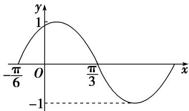

> [!faq]- 《专题4   函数y＝Asin(ωx＋φ)的图象-三角函数》例题解析
>
> > [!success]- **【答案】** A
>
> > [!note]- **【分析】**
> > 本题未单列分析。
>
> > [!note]- **【解析】**
> > 答案 D 解析 由图象可得 $A = \sqrt{2}$ ，最小正周期 $T = 4 \times \left(\frac{7\pi}{12} - \frac{\pi}{3}\right) = \pi$ ，则 $\omega = \frac{2\pi}{T} = 2$ 。由 $f\left(\frac{7\pi}{12}\right) =$ $\sqrt{2}\sin \left(\frac{7\pi}{6} +\varphi\right) = -\sqrt{2},|\varphi | <   \frac{\pi}{2}$ ，得 $\varphi = \frac{\pi}{3}$ ，则 $f(x) = \sqrt{2}\sin \left(2x + \frac{\pi}{3}\right)$ ，所以 $f\left(\frac{11\pi}{24}\right) = \sqrt{2}\sin \left(\frac{11\pi}{12} +\frac{\pi}{3}\right) = \sqrt{2}\sin \frac{5\pi}{4} = -1.$ (3）已知函数 $f(x) = \sin (\omega x + \varphi)\left[\omega >0, - \frac{\pi}{2} \leq \varphi \leq \frac{\pi}{2}\right]$ 的图象上的一个最高点和它相邻的一个最低点的距离为 $2\sqrt{2}$ ，且过点 $\left(2, - \frac{1}{2}\right)$ ，则函数 $f(x) =$ \_\_\_\_.答案 $\sin \left(\frac{\pi}{2} x + \frac{\pi}{6}\right)$ 解析依题意得 $\sqrt{2^2 + \left(\frac{\pi}{\omega}\right)^2} = 2\sqrt{2}$ ，则 $\frac{\pi}{\omega} = 2$ ，即 $\omega = \frac{\pi}{2}$ 所以 $f(x) = \sin \left(\frac{\pi}{2} x + \varphi\right)$ ，由于该函数图象过点 $\left(2, - \frac{1}{2}\right)$ 因此 $\sin (\pi +\varphi) = -\frac{1}{2}$ 即 $\sin \varphi = \frac{1}{2}$ 而 $-\frac{\pi}{2}\leq \varphi \leq \frac{\pi}{2}$ 故 $\varphi = \frac{\pi}{6}$ 所以 $f(x) = \sin \left(\frac{\pi}{2} x + \frac{\pi}{6}\right)$ (4）将函数 $f(x)$ 的图象上所有点向右平移个单位长度，得到函数 $g(x)$ 的图象．若函数 $g(x) = A\sin (\omega x+$ $\varphi)(A > 0,\omega >0,|\varphi |\leq \frac{\pi}{2})$ 的部分图象如图所示，则函数 $f(x)$ 的解析式为（）
> >
> > 
> >
> > A. $f(x) = \sin \left( x + \frac{5\pi}{12} \right)$ B. $f(x) = -\cos \left( 2x + \frac{\pi}{3} \right)$ C. $f(x) = \cos \left( 2x + \frac{\pi}{3} \right)$ D. $f(x) = \sin \left( 2x + \frac{7\pi}{12} \right)$
> >
> > 答案 C 解析 法一：根据函数 $g(x)$ 的图象可知 A=1， $\frac{1}{2}T=\frac{\pi}{3}+\frac{\pi}{6}=\frac{\pi}{2}$ ， $T=\pi=\frac{2\pi}{\omega}$ ， $\omega=2$ ，所以 $g(x)=\sin(2x+\varphi)$ ，所以 $g\left(\frac{\pi}{3}\right)=\sin\left(\frac{2\pi}{3}+\varphi\right)=0$ ，所以 $\frac{2\pi}{3}+\varphi=\pi+k\pi$ ， $k\in Z$ ， $\varphi=\frac{\pi}{3}+k\pi$ ， $k\in Z$ ，又因为 $|\varphi|<\frac{\pi}{2}$ ，所以 $\varphi=\frac{\pi}{3}$ ，所以 $g(x)=\sin\left(2x+\frac{\pi}{3}\right)$ ，将 $g(x)=\sin\left(2x+\frac{\pi}{3}\right)$ 的图象向左平移 $\frac{\pi}{4}$ 个单位长度后，即可得到函数 $f(x)$ 的图象，所以函数 $f(x)$ 的解析式为 $f(x)=g\left(x+\frac{\pi}{4}\right)=\sin\left[2\left(x+\frac{\pi}{4}\right)+\frac{\pi}{3}\right]=\sin\left(\frac{\pi}{2}+2x+\frac{\pi}{3}\right)=\cos\left(2x+\frac{\pi}{3}\right)$ .
> >
> > 法二：根据 $g(x)$ 的图象可知 $g\left(\frac{\frac{\pi}{3}-\frac{\pi}{6}}{2}\right)=g\left(\frac{\pi}{12}\right)=1$ ，因为 $f(x)$ 的图象向右平移 $\frac{\pi}{4}$ 个单位长度后，即可得到 $g(x)$ 的图象，所以 $f\left(\frac{\pi}{12}-\frac{\pi}{4}\right)=f\left(-\frac{\pi}{6}\right)=1$ ，对于 A， $f\left(-\frac{\pi}{6}\right)=\sin\frac{\pi}{4} \neq 1$ ，不符合题意；对于 B， $f\left(-\frac{\pi}{6}\right)=-\cos 0=-1 \neq 1$ ，不符合题意；对于 C， $f\left(-\frac{\pi}{6}\right)=\cos 0=1$ ，符合题意；对于 D， $f\left(-\frac{\pi}{6}\right)=\sin\frac{\pi}{4} \neq 1$ ，不符合题意.
