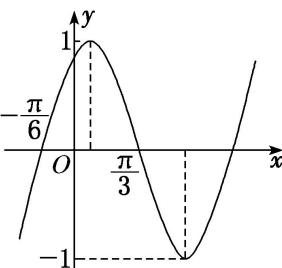

<!-- question-source:start -->
15. 已知函数 $f(x) = A \sin (\omega x + \varphi) \left( \omega > 0, -\frac{\pi}{2} < \varphi < \frac{\pi}{2} \right)$ 的部分图象如图所示，则 $\varphi$ 的值为（）

A. $-\frac{\pi}{3}$ B. $\frac{\pi}{3}$ C. $-\frac{\pi}{6}$ D. $\frac{\pi}{6}$
<!-- question-source:end -->

![[高中/总复习/专题/三角函数/专题4   函数y＝Asin(ωx＋φ)的图象-三角函数/考点03_由图象确定__y___A__sin___omega_x____varphi___的解析式/对点训练/answers/Q00038952A1.md]]
