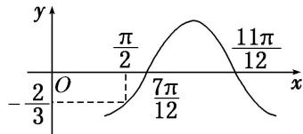

<!-- question-source:start -->
18. 已知函数 $f(x) = A \cos (\omega x + \varphi)$ 的图象如图所示， $f\left(\frac{\pi}{2}\right) = -\frac{2}{3}$ ，则 $f\left(-\frac{\pi}{6}\right) = (\quad)$

A. $-\frac{2}{3}$ B. $-\frac{1}{2}$ C. $\frac{2}{3}$ D. $\frac{1}{2}$
<!-- question-source:end -->

![[高中/总复习/专题/三角函数/专题4   函数y＝Asin(ωx＋φ)的图象-三角函数/考点03_由图象确定__y___A__sin___omega_x____varphi___的解析式/对点训练/answers/Q00038955A1.md]]
