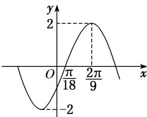

<!-- question-source:start -->
21. 将函数 $f(x)$ 的图象向右平移 $\frac{\pi}{6}$ 个单位长度，再将所得函数图象上的所有点的横坐标缩短到原来的 $\frac{2}{3}$ ，得到函数 $g(x) = A\sin (\omega x + \varphi)\left[A > 0, \omega > 0, |\varphi| < \frac{\pi}{2}\right]$ 的图象。已知函数 $g(x)$ 的部分图象如图所示，则函数 $f(x)()$

A. 最小正周期为 $\frac{2}{3}\pi$ ，最大值为 2 B. 最小正周期为 $\pi$ ，图象关于点 $\left[\frac{\pi}{6}, 0\right]$ 中心对称 C. 最小正周期为 $\frac{2}{3}\pi$ ，图象关于直线 $x = \frac{\pi}{6}$ 对称 D. 最小正周期为 $\pi$ ，在区间 $\left[\frac{\pi}{6}, \frac{\pi}{3}\right]$ 上单调递减
<!-- question-source:end -->

![[高中/总复习/专题/三角函数/专题4   函数y＝Asin(ωx＋φ)的图象-三角函数/考点03_由图象确定__y___A__sin___omega_x____varphi___的解析式/对点训练/answers/Q00038958A1.md]]
