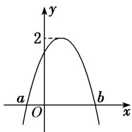

<!-- question-source:start -->
24. 函数 $f(x) = A \sin (2x + \theta) \left( A > 0, |\theta| \leq \frac{\pi}{2} \right)$ 的部分图象如图所示，且 $f(a) = f(b) = 0$ ，对不同的 $x_1, x_2 \in [a, b]$ ，

若 $f(x_{1}) = f(x_{2})$ ，有 $f(x_{1} + x_{2}) = \sqrt{3}$ ，则（）

A. $f(x)$ 在 $\left(-\frac{5\pi}{12}, \frac{\pi}{12}\right)$ 上是减函数 B. $f(x)$ 在 $\left(-\frac{5\pi}{12}, \frac{\pi}{12}\right)$ 上是增函数 C. $f(x)$ 在 $\left(\frac{\pi}{3}, \frac{5\pi}{6}\right)$ 上是减函数 D. $f(x)$ 在 $\left(\frac{\pi}{3}, \frac{5\pi}{6}\right)$ 上是增函数
<!-- question-source:end -->

![[高中/总复习/专题/三角函数/专题4   函数y＝Asin(ωx＋φ)的图象-三角函数/考点03_由图象确定__y___A__sin___omega_x____varphi___的解析式/对点训练/answers/Q00038961A1.md]]
