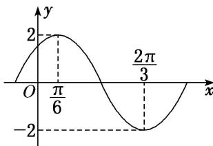

> [!faq]- 《专题4   函数y＝Asin(ωx＋φ)的图象-三角函数》例题解析
>
> > [!success]- **【答案】** 详见解析
>
> > [!note]- **【分析】**
> > 本题未单列分析。
>
> > [!note]- **【解析】**
> > (1)求函数 $f(x)$ 的解析式，并写出其图象的对称中心；
> >
> > (2)若方程 $f(x) + 2\cos \left(4x + \frac{\pi}{3}\right) = a$ 有实数解，求 $a$ 的取值范围.
> >
> > 
