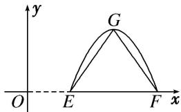

> [!faq]- 《专题4   函数y＝Asin(ωx＋φ)的图象-三角函数》例题解析
>
> > [!success]- **【答案】** 详见解析
>
> > [!note]- **【分析】**
> > 本题未单列分析。
>
> > [!note]- **【解析】**
> > (1) =$ \_\_\_\_.
> > 
> > 19. 答案 $-\sqrt{3}$ 解析 由题意得， $A=\sqrt{3}$ ， $T=4=\frac{2\pi}{\omega}$ ， $\omega=\frac{\pi}{2}$ 。又 $\because f(x)=A\cos(\omega x+\varphi)$ 为奇函数， $\therefore \varphi=\frac{\pi}{2}+k\pi, k\in\mathbf{Z}, \because 0<\varphi<\pi,$ 则 $\varphi=\frac{\pi}{2}, \therefore f(x)=\sqrt{3}\cos\left(\frac{\pi}{2}x+\frac{\pi}{2}\right), \therefore f
> > (1)=-\sqrt{3}.$
