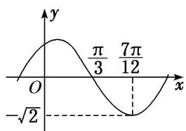

<!-- question-source:start -->
(2) 函数 $f(x) = A \sin (\omega x + \varphi) \left\{ A > 0, \quad \omega > 0, \quad |\varphi| < \frac{\pi}{2} \right\}$ 的部分图象如图所示，则 $f\left(\frac{11\pi}{24}\right)$ 的值为（）

A. $-\frac{\sqrt{6}}{2}$ B. $-\frac{\sqrt{3}}{2}$ C. $-\frac{\sqrt{2}}{2}$ D. $-1$
<!-- question-source:end -->

![[高中/总复习/专题/三角函数/专题4   函数y＝Asin(ωx＋φ)的图象-三角函数/考点03_由图象确定函数解析式/例题/answers/Q00042186A1.md]]
