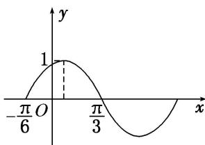

<!-- question-source:start -->
(6) 函数 $f(x) = A \sin (\omega x + \varphi) A > 0, \omega > 0, |\varphi| < \frac{\pi}{2}$ 的部分图象如图所示，若 $x_1, x_2 \in \left(-\frac{\pi}{6}, \frac{\pi}{3}\right)$ ，且 $f(x_1) = f(x_2)$ ，则 $f(x_1 + x_2) =$ \_\_\_\_.

<!-- question-source:end -->

![[高中/总复习/专题/三角函数/专题4   函数y＝Asin(ωx＋φ)的图象-三角函数/考点03_由图象确定函数解析式/例题/answers/Q00042188A1.md]]
