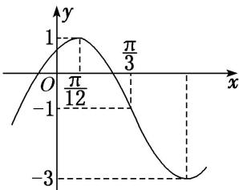

<!-- question-source:start -->
17. 已知 $f(x) = A \sin (\omega x + \varphi) + B \left( A > 0, \omega > 0, |\varphi| < \frac{\pi}{2} \right)$ 的部分图象如图，则 $f(x)$ 图象的一个对称中心是（）

A. $\left[\frac{5\pi}{6}, -1\right]$ B. $\left[\frac{\pi}{12}, 0\right]$ C. $\left[\frac{\pi}{12}, -1\right]$ D. $\left[\frac{5\pi}{6}, 0\right]$
<!-- question-source:end -->

![[高中/总复习/专题/三角函数/专题4   函数y＝Asin(ωx＋φ)的图象-三角函数/考点03_由图象确定函数解析式/对点训练/answers/Q00038954A1.md]]
