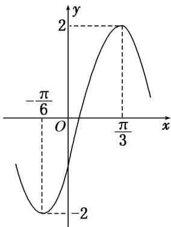

<!-- question-source:start -->
23. 函数 $f(x) = A \cos (\omega x + \varphi) (A > 0, \omega > 0, -\pi < \varphi < 0)$ 的部分图象如图所示，为了得到 $g(x) = A \sin \omega x$ 的图象，只需将函数 $y = f(x)$ 的图象（）

A. 向左平移 $\frac{\pi}{6}$ 个单位长度 B. 向左平移 $\frac{\pi}{12}$ 个单位长度 C. 向右平移 $\frac{\pi}{6}$ 个单位长度 D. 向右平移 $\frac{\pi}{12}$ 个单位长度
<!-- question-source:end -->

![[高中/总复习/专题/三角函数/专题4   函数y＝Asin(ωx＋φ)的图象-三角函数/考点03_由图象确定函数解析式/对点训练/answers/Q00038960A1.md]]
