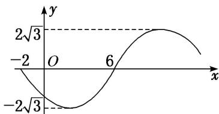

<!-- question-source:start -->
16. 已知函数 $f(x) = A \sin (\omega x + \varphi) (A > 0, \omega > 0, |\varphi| < \pi)$ 的部分图象如图所示，则 $f(x)$ 的解析式为（）

A. $f(x)=2\sqrt{3}\sin\left(\frac{\pi x}{8}+\frac{\pi}{4}\right)$ B. $f(x)=2\sqrt{3}\sin\left(\frac{\pi x}{8}+\frac{3\pi}{4}\right)$ C. $f(x)=2\sqrt{3}\sin\left(\frac{\pi x}{8}-\frac{\pi}{4}\right)$ D. $f(x)=2\sqrt{3}\sin\left(\frac{\pi x}{8}-\frac{3\pi}{4}\right)$
<!-- question-source:end -->

![[高中/总复习/专题/三角函数/专题4   函数y＝Asin(ωx＋φ)的图象-三角函数/考点03_由图象确定函数解析式/对点训练/answers/Q00042190A1.md]]
