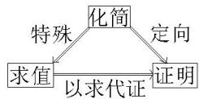

<!-- source-part:1 pages:1-13 -->

# 专题六 三角恒等变换题型篇

## 三角恒等变换的基本题型

1. 求值：三角函数的求值有三种类型

(1)给角求值：一般所给出的角都是非特殊角，要观察所给角与特殊角间的关系，利用三角变换消去非特殊角，转化为求特殊角的三角函数值问题；

(2)给值求值: 给出某些角的三角函数式的值, 求另外一些角的三角函数值, 解题的关键在于“变角”, 如 $\alpha = (\alpha + \beta) - \beta, 2\alpha = (\alpha + \beta) + (\alpha - \beta)$ 等, 把所求角用含已知角的式子表示, 求解时要注意角的范围的讨论;

(3)给值求角：实质上转化为“给值求值”问题，由所得的所求角的函数值结合所求角的范围及函数的单调性求得角.

2. 化简：化简目标：项数尽量少、次数尽量低、尽量不含分母和根号．对能求出具体数值的，要求出值.

3. 证明：三角函数的求值有两种类型

(1)无条件三角恒等式的证明：证明方法有：化繁为简法、左右归一法、变更论题法；

(2)有条件三角恒等式的证明：

可分为四类：①已知角度关系，证明函数关系；②已知函数关系证明角度关系；③已知函数关系证明函数关系；④三角形内的边角恒等式的证明.

证明方法除了注意到无条件三角恒等式的证明方法外，还用到直推法与代入法两种方法.

4. 三种题型的相互关系:

![[高中/总复习/专题/三角函数/专题6 三角恒等变换题型篇-三角函数/考点01_给角求值/考点01_给角求值.md]]
![[高中/总复习/专题/三角函数/专题6 三角恒等变换题型篇-三角函数/考点02_给值求值/考点02_给值求值.md]]
![[高中/总复习/专题/三角函数/专题6 三角恒等变换题型篇-三角函数/考点03_给值求角/考点03_给值求角.md]]
