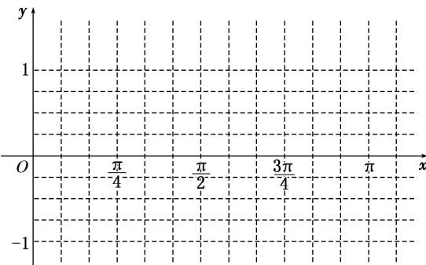

> [!faq]- 《专题7 三角恒等变换应用篇(解答题)-三角函数》例题解析
>
> > [!success]- **【答案】** 详见解析
>
> > [!note]- **【分析】**
> > 本题未单列分析。
>
> > [!note]- **【解析】**
> > (1)求 $\omega$ 的值，并在下面提供的坐标系中画出函数 $y=f(x)$ 在区间 $[0,\pi]$ 上的图象；
> >
> > (2)函数 $y=f(x)$ 的图象可由函数 $y=\sin x$ 的图象经过怎样的变换得到？
> >
> > 
