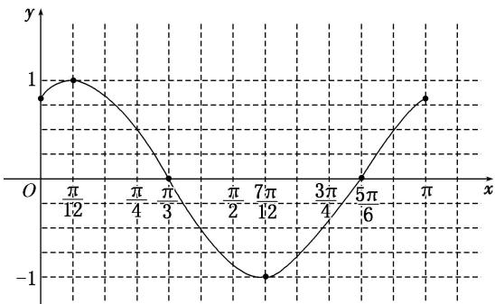

> [!faq]- 《专题7 三角恒等变换应用篇(解答题)-三角函数》例题解析
>
> > [!success]- **【答案】** 详见解析
>
> > [!note]- **【分析】**
> > 本题未单列分析。
>
> > [!note]- **【解析】**
> > 解 (1)由题意知 $f(x) = \sin \left( \omega x + \frac{\pi}{3} \right)$ ，因为 $T = \pi$ ，所以 $\frac{2\pi}{\omega} = \pi$ ，即 $\omega = 2$ ，故 $f(x) = \sin \left( 2x + \frac{\pi}{3} \right)$ . 列表如下：
> > <table><tr><td> $2x+\frac{\pi}{3}$ </td><td> $\frac{\pi}{3}$ </td><td> $\frac{\pi}{2}$ </td><td> $\pi$ </td><td> $\frac{3\pi}{2}$ </td><td> $2\pi$ </td><td> $\frac{7\pi}{3}$ </td></tr><tr><td> $x$ </td><td>0</td><td> $\frac{\pi}{12}$ </td><td> $\frac{\pi}{3}$ </td><td> $\frac{7\pi}{12}$ </td><td> $\frac{5\pi}{6}$ </td><td> $\pi$ </td></tr><tr><td> $f(x)$ </td><td> $\frac{\sqrt{3}}{2}$ </td><td>1</td><td>0</td><td>-1</td><td>0</td><td> $\frac{\sqrt{3}}{2}$ </td></tr></table>
> > $y=f(x)$ 在 $[0,\pi]$ 上的图象如图所示.
> > 
> > (2)将 $y = \sin x$ 的图象上的所有点向左平移 $\frac{\pi}{3}$ 个单位长度，得到函数 $y = \sin \left(\frac{x + \frac{\pi}{3}}{3}\right)$ 的图象，再将 $y = \sin \left(\frac{x + \frac{\pi}{3}}{3}\right)$ 的图象上所有点的横坐标缩短到原来的 $\frac{1}{2}$ (纵坐标不变)，得到函数 $f(x) = \sin \left(\frac{2x + \frac{\pi}{3}}{3}\right) (x \in \mathbb{R})$ 的图象.
