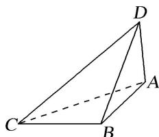
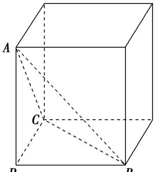
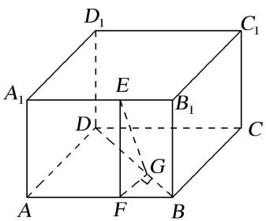

<!-- source-part:1 pages:1-6 -->

## 专题一 墙角模型

如果一个多面体的各个顶点都在同一个球面上，那么称这个多面体是球的内接多面体，这个球称为多面体的外接球。有关多面体外接球的问题，是立体几何的一个重点与难点，也是高考考查的一个热点。考查学生的空间想象能力以及化归能力。研究多面体的外接球问题，既要运用多面体的知识，又要运用球的知识，解决这类问题的关键是抓住内接的特点，即球心到多面体的顶点的距离等于球的半径。并且还要特别注意多面体的有关几何元素与球的半径之间的关系，而多面体外接球半径的求法在解题中往往会起到至关重要的作用。

球的内切问题主要是指球外切多面体与旋转体，解答时首先要找准切点，通过作截面来解决。如果外切的是多面体，则作截面时主要抓住多面体过球心的对角面来作。当球与多面体的各个面相切时，注意球心到各面的距离相等即球的半径，求球的半径时，可用球心与多面体的各顶点连接，球的半径为分成的小棱锥的高，用体积法来求球的半径。

## 空间几何体的外接球与内切球十大模型

1. 墙角模型；2. 对棱相等模型；3. 汉堡模型；4. 垂面模型；5. 切瓜模型；6. 斗笠模型；7. 鳄鱼模型；8. 已知球心或球半径模型；9. 最值模型；10. 内切球模型。

## 【方法总结】

墙角模型是三棱锥有一条侧棱垂直于底面且底面是直角三角形模型，用构造法(构造长方体)解决．外接球的直径等于长方体的体对角线长(在长方体的同一顶点的三条棱长分别为a，b，c，外接球的半径为R，则 $2R=\sqrt{a^{2}+b^{2}+c^{2}}$ ．)，秒杀公式： $R^{2}=\frac{a^{2}+b^{2}+c^{2}}{4}$ ．可求出球的半径从而解决问题．有以下四种类型：

  
类型Ⅱ

  
类型III

例外型  
  
【例题选讲】

[例] (1)已知三棱锥 $A - BCD$ 的四个顶点 $A, B, C, D$ 都在球 $O$ 的表面上， $AC \perp$ 平面 $BCD, BC \perp CD$ 且 $AC = \sqrt{3}, BC = 2, CD = \sqrt{5}$ ，则球 $O$ 的表面积为（）A. $12\pi$ B. $7\pi$ C. $9\pi$ D. $8\pi$

答案 A 解析 由 $AC \perp$ 平面 $BCD, BC \perp CD$ 知三棱锥 $A - BCD$ 可构造以 $AC, BC, CD$ 为三条棱的长方体，设球 $O$ 的半径为 $R$ ，则有 $(2R)^{2} = AC^{2} + BC^{2} + CD^{2} = 3 + 4 + 5 = 12$ ，所以 $S_{\text{球}} = 4\pi R^{2} = 12\pi$ ，故选 A. (2) 若三棱锥 $S - ABC$ 的三条侧棱两两垂直，且 $SA = 2, SB = SC = 4$ ，则该三棱锥的外接球半径为 ( ).

A. 3 B. 6 C. 36 D. 9

答案 A 解析 $(2R)^{2}=\sqrt{4+16+16}=6$ ，R=3，故选 A.

(3)已知 S, A, B, C，是球 O 表面上的点， $SA \perp$ 平面 ABC， $AB \perp BC$ ， $SA = AB = 1$ ， $BC = \sqrt{2}$ ，则球 O 的表面积等于（）.
A. $4\pi$ B. $3\pi$ C. $2\pi$ D. $\pi$

答案 解析 由已知， $2R = \sqrt{1^2 + 1^2 + (\sqrt{2})^2} = 2$ ， $\therefore S_{\text{球}} = 4\pi R^2 = 4\pi.$

(4)在正三棱锥 S-ABC 中，M，N 分别是棱 SC，BC 的中点，且 $AM \perp MN$ ，若侧棱 $SA = 2\sqrt{3}$ ，则正三棱锥 S-ABC 外接球的表面积是 \_\_\_\_.

答案 $36\pi$ 解析 $\because AM \perp MN, SB \parallel MN, \therefore AM \perp SB, \because AC \perp SB, \therefore SB \perp$ 平面 SAC, $\therefore SB \perp SA, SB \perp SC, \because SB \perp SA, BC \perp SA, \therefore SA \perp$ 平面 SBC, $\therefore SA \perp SC,$ 故三棱锥 S-ABC 的三棱条侧棱两两互相垂直, $\therefore (2R)^{2} = (2\sqrt{3})^{2} + (2\sqrt{3})^{2} + (2\sqrt{3})^{2} = 36$ , 即 $4R^{2} = 36$ , $\therefore$ 正三棱锥 S-ABC 外接球的表面积是 $36\pi$ .

(5)(2019 全国 I) 已知三棱锥 $P - ABC$ 的四个顶点在球 $O$ 的球面上, $PA = PB = PC$ , $\triangle ABC$ 是边长为 2 的正三角形, $E$ , $F$ 分别是 $PA$ , $AB$ 的中点, $\angle CEF = 90^\circ$ , 则球 $O$ 的体积为 ( ). A. $8\sqrt{6}\pi$ B. $4\sqrt{6}\pi$ C. $2\sqrt{6}\pi$ D. $\sqrt{6}\pi$

答案 D 解析 解法一: $\because PA = PB = PC, \triangle ABC$ 为边长为 2 的等边三角形, $\therefore P - ABC$ 为正三棱锥, $\therefore PB \perp AC$ , 又 $E$ , $F$ 分别为 $PA$ , $AB$ 的中点, $\therefore EF // PB$ , $\therefore EF \perp AC$ , 又 $EF \perp CE$ , $CE \cap AC = C$ , $\therefore EF \perp$ 平面 $PAC$ , $\therefore PB \perp$ 平面 $PAC$ , $\therefore \angle APB = 90^\circ$ , $\therefore PA = PB = PC = \sqrt{2}$ , $\therefore P - ABC$ 为正方体的一部分, $2R = \sqrt{2 + 2 + 2}$ , $= \sqrt{6}$ , 即 $R = \frac{\sqrt{6}}{2}$ , $\therefore V = \frac{4}{3} \pi R^3 = \frac{4}{3} \pi \times \frac{6\sqrt{6}}{8} = \sqrt{6} \pi$ , 故选 D.

  
(解法一)

  
(解法二)

解法二：设 PA = PB = PC = 2x，E, F 分别为 PA, AB 的中点，∴ EF // PB，且 $EF = \frac{1}{2}PB = x$ ，∵ $\triangle ABC$ 为边长为 2 的等边三角形，∴ $CF = \sqrt{3}$ ，又 $\angle CEF = 90^{\circ}$ ，∴ $CE = \sqrt{3 - x^{2}}$ ， $AE = \frac{1}{2}PA = x$ ， $\triangle AEC$ 中，由余弦定理可得 $\cos\angle EAC=\frac{x^{2}+4-\left(3-x^{2}\right)}{2\times2\times x}$ ，作 $PD\perp AC$ 于 D，∵ PA=PC，∴ D 为 AC 的中点， $\cos\angle E\ AC=\frac{AD}{PA}=\frac{1}{2x},\therefore\frac{x^{2}+4-3+x^{2}}{4x}=\frac{1}{2x},\therefore2x^{2}+1=2,\therefore x^{2}=\frac{1}{2},x=\frac{\sqrt{2}}{2},\therefore PA=PB=PC=\sqrt{2}$ 又 AB = BC = AC = 2，∴ PA, PB, PC 两两垂直，∴ $2R = \sqrt{2 + 2 + 2} = \sqrt{6}$ ，∴ $R = \frac{\sqrt{6}}{2}$ $\therefore V=\frac{4}{3}\pi R^{3}=\frac{4}{3}\pi\times=\frac{6\sqrt{6}}{8}=\sqrt{6}\pi$ ，故选D.

(6)已知二面角 $\alpha - l - \beta$ 的大小为 $\frac{\pi}{3}$ , 点 $P \in \alpha$ , 点 $P$ 在 $\beta$ 内的正投影为点 $A$ , 过点 $A$ 作 $AB \perp l$ , 垂足为点 $B$ , 点 $C \in l$ , $BC = 2\sqrt{2}$ , $PA = 2\sqrt{3}$ , 点 $D \in \beta$ , 且四边形 $ABCD$ 满足 $\angle BCD + \angle DAB = \pi$ . 若四面体 $PACD$ 的四个顶点都在同一球面上, 则该球的体积为 \_\_\_\_.

答案 $8\sqrt{6}\pi$ 解析 $\because \angle BCD + \angle DAB = \pi, \therefore A, B, C, D$ 四点共圆，直径为 $AC, \because PA \perp$ 平面 $\beta, AB \perp l, \therefore$ 易得 $PB \perp l$ ，即 $\angle PBA$ 为二面角 $\alpha - l - \beta$ 的平面角，即 $\angle PBA = \frac{\pi}{3}, \because PA = 2\sqrt{3}, \therefore BA = 2, \because BC = 2\sqrt{2}, \therefore AC = 2\sqrt{3}$ 。设球的半径为 $R$ ，则 $2\sqrt{3} - \sqrt{R^2 - (\sqrt{3})^2} = \sqrt{R^2 - (\sqrt{3})^2}, \therefore R = \sqrt{6}, V = \frac{4\pi}{3} (\sqrt{6})^3 = 8\sqrt{6}\pi.$ 【对点训练】

1. 点 $A, B, C, D$ 均在同一球面上，且 $AB, AC, AD$ 两两垂直，且 $AB = 1, AC = 2, AD = 3$ ，则该球的表面积为( )

A. $7\pi$ B. $14\pi$ C. $\frac{7}{2}\pi$ D. $\frac{7\sqrt{14}\pi}{3}$

1. 答案 B 解析 三棱锥 A-BCD 的三条侧棱两两互相垂直，所以把它补为长方体，而长方体的体对角线长为其外接球的直径。所以长方体的体对角线长是 $\sqrt{1^{2}+2^{2}+3^{2}}=\sqrt{14}$ ，它的外接球半径是 $\frac{\sqrt{14}}{2}$ ，外接球的表面积是 $4\pi\times\left(\frac{\sqrt{14}}{2}\right)2=14\pi$ 。

2. 等腰 $\triangle ABC$ 中, $AB=AC=5$ , $BC=6$ , 将 $\triangle ABC$ 沿 $BC$ 边上的高 $AD$ 折成直二面角 $B-AD-C$ , 则三棱锥 $B-ACD$ 的外接球的表面积为( )

A. $5\pi$ B. $\frac{20}{3}\pi$ C. $10\pi$ D. $34\pi$

2. 答案 D 解析 依题意，在三棱锥 B-ACD 中，AD, BD, CD 两两垂直，且 AD=4, BD=CD=3，
因此可将三棱锥 B-ACD 补形成一个长方体，该长方体的长、宽、高分别为 3,3,4，且其外接球的直径 $2R=\sqrt{3^{2}+3^{2}+4^{2}}=\sqrt{34}$ ，故三棱锥 B-ACD 的外接球的表面积为 $4\pi R^{2}=34\pi$

3. 已知球 O 的球面上有四点 A, B, C, D, DA⊥平面 ABC, AB⊥BC, DA=AB=BC= $\sqrt{2}$ ，则球 O 的体积等于 \_\_\_\_.

3. 答案 $\sqrt{6}\pi$ 解析 如图，以 $DA, AB, BC$ 为棱长构造正方体，设正方体的外接球球 $O$ 的半径为 $R$ 则正方体的体对角线长即为球 O 的直径. $\therefore CD=\sqrt{(\sqrt{2})^{2}+(\sqrt{2})^{2}+(\sqrt{2})^{2}}=2R$ ，因此 $R=\frac{\sqrt{6}}{2}$ ，故球 O 的体积 $V=\frac{4\pi R^{3}}{3}=\sqrt{6}\pi$ .

4. 已知四面体 $P - ABC$ 四个顶点都在球 $O$ 的球面上, 若 $PB \perp$ 平面 $ABC$ , $AB \perp AC$ , 且 $AC = 1$ , $AB = PB = 2$ , 则球 $O$ 的表面积为 \_\_\_\_.

4. 答案 $9\pi$ 解析 由 $PB \perp$ 平面 $ABC, AB \perp AC$ , 可得图中四个直角三角形, 且 $PC$ 为 $\triangle PBC$ , $\triangle PAC$ 的公共斜边, 故球心 $O$ 为 $PC$ 的中点, 由 $AC = 1$ , $AB = PB = 2$ , $PC = 3$ , $\therefore$ 球 $O$ 的半径为 $\frac{3}{2}$ , 其表面积为 $9\pi$ .

5. 三棱锥 $P - ABC$ 中， $\triangle ABC$ 为等边三角形， $PA = PB = PC = 3$ ， $PA \perp PB$ ，三棱锥 $P - ABC$ 的外接球的体积为( )

A. $\frac{27}{2}\pi$ B. $\frac{27\sqrt{3}}{2}\pi$ C. $27\sqrt{3}\pi$ D. $27\pi$

5. 答案 B 解析 因为三棱锥 P-ABC 中，△ABC 为等边三角形，PA=PB=PC=3，所以 △PAB≌△PBC≌△PAC。因为 PA⊥PB，所以 PA⊥PC，PC⊥PB。以 PA，PB，PC 为过同一顶点的三条棱作正方体（如图所示），则正方体的外接球同时也是三棱锥 P-ABC 的外接球。因为正方体的体对角线长为 $\sqrt{3^{2}+3^{2}+3^{2}}=3\sqrt{3}$ ，所以其外接球半径 $R=\frac{3\sqrt{3}}{2}$ 。因此三棱锥 P-ABC 的外接球的体积 $V=\frac{4\pi}{3}\times\left(\frac{3\sqrt{3}}{2}\right)^{3}=\frac{27\sqrt{3}}{2}\pi$ ，故选 B。

6. 在空间直角坐标系 $Oxyz$ 中，四面体 $ABCD$ 各顶点的坐标分别为 $A(2, 2, 1)$ ， $B(2, 2, -1)$ ， $C(0, 2, 1)$ ， $D(0, 0, 1)$ ，则该四面体外接球的表面积是（） A. $16\pi$ B. $12\pi$ C. $4\sqrt{3}\pi$ D. $6\pi$

6. 答案 B 解析 在空间直角坐标系内画出 A, B, C, D 四个点，可得 $BA \perp AC$ , $DC \perp$ 平面 ABC，因此可以把四面体 ABCD 补成一个棱为 2 的正方体，其外接球的半径 $R = \frac{\sqrt{2^{2} + 2^{2} + 2^{2}}}{2} = \sqrt{3}$ . 所以外接球的表面积为 $4\pi R^{2} = 12\pi$ ，故选 B.

7. 在平行四边形 $ABCD$ 中, $\angle ABD = 90^{\circ}$ , 且 $AB = 1$ , $BD = \sqrt{2}$ , 若将其沿 $BD$ 折起使平面 $ABD \perp$ 平面 $BC$ $D$ , 则三棱锥 $A - BDC$ 的外接球的表面积为 (D)

A. $2\pi$ B. $8\pi$ C. $16\pi$ D. $4\pi$

7. 答案 D 解析 画出对应的平面图形和立体图形，如图所示.

在立体图形中，设 $AC$ 的中点为 $O$ ，连接 $OB$ ， $OD$ ，因为平面 $ABD \perp$ 平面 $BCD$ ， $CD \perp BD$ ，所以 $CD \perp$ 平面 $ABD$ ，又 $AB \perp BD$ ，所以 $AB \perp$ 平面 $BCD$ ，所以 $\triangle CDA$ 与 $\triangle CBA$ 都是以 $AC$ 为斜边的直角三角形，所以 $OA = OC = OB = OD$ ，所以点 $O$ 为三棱锥 $A - BDC$ 的外接球的球心．于是，外接球的半径 $r = \frac{1}{2} AC = \frac{1}{2}\sqrt{CD^2 + DA^2} = \frac{1}{2}\sqrt{1^2 + (\sqrt{3})^2} = 1$ ．故外接球的表面积 $S = 4\pi r^2 = 4\pi$ ．故选 D.

8. 在正三棱锥 $S - ABC$ 中，点 $M$ 是 $SC$ 的中点，且 $AM \perp SB$ ，底面边长 $AB = 2\sqrt{2}$ ，则正三棱锥 $S - ABC$ 的外接球的表面积为( )

A. $6\pi$ B. $12\pi$ C. $32\pi$ D. $36\pi$

8. 答案 B 解析 因为三棱锥 S-ABC 为正三棱锥，所以 $SB \perp AC$ ，又 $AM \perp SB, AC \cap AM = A, AC, AM \subset$ 平面 SAC，所以 $SB \perp$ 平面 SAC，所以 $SB \perp SA, SB \perp SC$ ，同理 $SA \perp SC$ ，即 SA, SB, SC 三线两两垂直，且 $AB = 2\sqrt{2}$ ，所以 $SA = SB = SC = 2$ ，所以 $(2R)^{2} = 3 \times 2^{2} = 12$ ，所以球的表面积 $S = 4\pi R^{2} = 12\pi$ ，故选 B.

9. 在古代将四个面都为直角三角形的四面体称之为鳖臑, 已知四面体 $A - BCD$ 为鳖臑, $AB \perp$ 平面 $BCD$ , 且 $AB = BC = \frac{\sqrt{3}}{6} CD$ , 若此四面体的体积为 $\frac{8\sqrt{3}}{3}$ , 则其外接球的表面积为 \_\_\_\_.

9. 答案 $56 \pi$ 解析 四面体 $A - BCD$ 为鳖臑，则由题意可知 $\triangle BCD$ 中只能 $\angle BCD$ 为直角，则四面体 $A - BCD$ 的体积为 $\frac{1}{3} \times \frac{1}{2} \times CD \cdot \frac{\sqrt{3}}{6} CD \cdot \frac{\sqrt{3}}{6} CD = \frac{8\sqrt{3}}{3}$ ，解得 $CD = 4\sqrt{3}$ 。易知外接球的球心为 $AD$ 的中点，易求得 $AD = 2\sqrt{14}$ ，所以球的半径为 $\sqrt{14}$ ，所以球的表面积为 $56 \pi$ 。

10. 在长方体 $ABCD-A_{1}B_{1}C_{1}D_{1}$ 中，底面 ABCD 是边长为 $3\sqrt{2}$ 的正方形， $AA_{1}=3$ ，E 是线段 $A_{1}B_{1}$ 上一点，
若二面角 A-BD-E 的正切值为 3，则三棱锥 $A-A_{1}D_{1}E$ 外接球的表面积为 \_\_\_\_。

10. 答案 $35\pi$ 解析 过点 $E$ 作 $EF \parallel AA_{1}$ 交 $AB$ 于 $F$ , 过 $F$ 作 $FG \perp BD$ 于 $G$ , 连接 $EG$ , 则 $\angle EGF$ 为二面角 $A - BD - E$ 的平面角, $\because \tan \angle EGF = 3$ , $\therefore \frac{EF}{FG} = 3$ , $\because EF = AA_{1} = 3$ , $\therefore FG = 1$ , 则 $BF = \sqrt{2} = B_{1}E$ , $\therefore A_{1}E = 2\sqrt{2}$ , 则三棱锥 $A - A_{1}D_{1}E$ 外接球的直径为 $\sqrt{8 + 9 + 18} = \sqrt{35}$ , 因此三棱锥 $A - A_{1}D_{1}E$ 外接球的表面积 $S = 35\pi$ .

