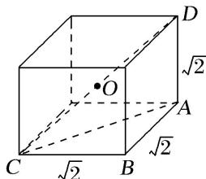

> [!faq]- 《专题1 墙角模型-几何体的外接球与内切球10大模型》例题解析
>
> > [!success]- **【答案】** 详见解析
>
> > [!note]- **【分析】**
> > 本题未单列分析。
>
> > [!note]- **【解析】**
> > 答案 $\sqrt{6}\pi$ 解析 如图，以 $DA, AB, BC$ 为棱长构造正方体，设正方体的外接球球 $O$ 的半径为 $R$ 则正方体的体对角线长即为球 O 的直径. $\therefore CD=\sqrt{(\sqrt{2})^{2}+(\sqrt{2})^{2}+(\sqrt{2})^{2}}=2R$ ，因此 $R=\frac{\sqrt{6}}{2}$ ，故球 O 的体积 $V=\frac{4\pi R^{3}}{3}=\sqrt{6}\pi$ .
> > 
