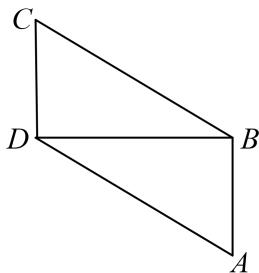
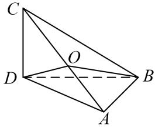

> [!faq]- 《专题1 墙角模型-几何体的外接球与内切球10大模型》例题解析
>
> > [!success]- **【答案】** D
>
> > [!note]- **【分析】**
> > 本题未单列分析。
>
> > [!note]- **【解析】**
> > 答案 D 解析 画出对应的平面图形和立体图形，如图所示.
> > 
> > 
> > 在立体图形中，设 $AC$ 的中点为 $O$ ，连接 $OB$ ， $OD$ ，因为平面 $ABD \perp$ 平面 $BCD$ ， $CD \perp BD$ ，所以 $CD \perp$ 平面 $ABD$ ，又 $AB \perp BD$ ，所以 $AB \perp$ 平面 $BCD$ ，所以 $\triangle CDA$ 与 $\triangle CBA$ 都是以 $AC$ 为斜边的直角三角形，所以 $OA = OC = OB = OD$ ，所以点 $O$ 为三棱锥 $A - BDC$ 的外接球的球心．于是，外接球的半径 $r = \frac{1}{2} AC = \frac{1}{2}\sqrt{CD^2 + DA^2} = \frac{1}{2}\sqrt{1^2 + (\sqrt{3})^2} = 1$ ．故外接球的表面积 $S = 4\pi r^2 = 4\pi$ ．
> >
> > 故选 **D**.
