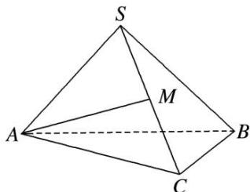

> [!faq]- 《专题1 墙角模型-几何体的外接球与内切球10大模型》例题解析
>
> > [!success]- **【答案】** B
>
> > [!note]- **【分析】**
> > 本题未单列分析。
>
> > [!note]- **【解析】**
> > 答案 B 解析 因为三棱锥 S-ABC 为正三棱锥，所以 $SB \perp AC$ ，又 $AM \perp SB, AC \cap AM = A, AC, AM \subset$ 平面 SAC，所以 $SB \perp$ 平面 SAC，所以 $SB \perp SA, SB \perp SC$ ，同理 $SA \perp SC$ ，即 SA, SB, SC 三线两两垂直，且 $AB = 2\sqrt{2}$ ，所以 $SA = SB = SC = 2$ ，所以 $(2R)^{2} = 3 \times 2^{2} = 12$ ，所以球的表面积 $S = 4\pi R^{2} = 12\pi$ ，故选 B.
> > 
