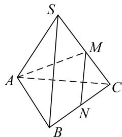
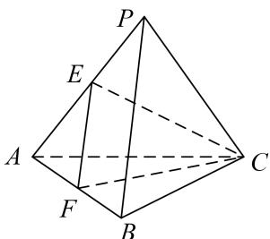
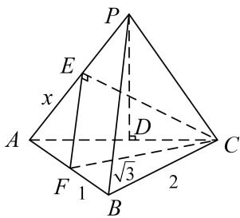

> [!faq]- 《专题1 墙角模型-几何体的外接球与内切球10大模型》例题解析
>
> > [!success]- **【答案】** D
>
> > [!note]- **【分析】**
> > 本题未单列分析。
>
> > [!note]- **【解析】**
> > (1)已知三棱锥 $A - BCD$ 的四个顶点 $A, B, C, D$ 都在球 $O$ 的表面上， $AC \perp$ 平面 $BCD, BC \perp CD$ 且 $AC = \sqrt{3}, BC = 2, CD = \sqrt{5}$ ，则球 $O$ 的表面积为（）A. $12\pi$ B. $7\pi$ C. $9\pi$ D. $8\pi$
> > 答案 A 解析 由 $AC \perp$ 平面 $BCD, BC \perp CD$ 知三棱锥 $A - BCD$ 可构造以 $AC, BC, CD$ 为三条棱的长方体，设球 $O$ 的半径为 $R$ ，则有 $(2R)^{2} = AC^{2} + BC^{2} + CD^{2} = 3 + 4 + 5 = 12$ ，所以 $S_{\text{球}} = 4\pi R^{2} = 12\pi$ ，故选 A.
> > (2) 若三棱锥 $S - ABC$ 的三条侧棱两两垂直，且 $SA = 2, SB = SC = 4$ ，则该三棱锥的外接球半径为 ( ).
> > A. 3 B. 6 C. 36 D. 9
> > 答案 A 解析 $(2R)^{2}=\sqrt{4+16+16}=6$ ，R=3，故选 A.
> > (3)已知 S, A, B, C，是球 O 表面上的点， $SA \perp$ 平面 ABC， $AB \perp BC$ ， $SA = AB = 1$ ， $BC = \sqrt{2}$ ，则球 O 的表面积等于（）.
> > A. $4\pi$ B. $3\pi$ C. $2\pi$ D. $\pi$
> > 答案 解析 由已知， $2R = \sqrt{1^2 + 1^2 + (\sqrt{2})^2} = 2$ ， $\therefore S_{\text{球}} = 4\pi R^2 = 4\pi.$
> > (4)在正三棱锥 S-ABC 中，M，N 分别是棱 SC，BC 的中点，且 $AM \perp MN$ ，若侧棱 $SA = 2\sqrt{3}$ ，则正三棱锥 S-ABC 外接球的表面积是 \_\_\_\_.
> > 答案 $36\pi$ 解析 $\because AM \perp MN, SB \parallel MN, \therefore AM \perp SB, \because AC \perp SB, \therefore SB \perp$ 平面 SAC, $\therefore SB \perp SA, SB \perp SC, \because SB \perp SA, BC \perp SA, \therefore SA \perp$ 平面 SBC, $\therefore SA \perp SC,$ 故三棱锥 S-ABC 的三棱条侧棱两两互相垂直, $\therefore (2R)^{2} = (2\sqrt{3})^{2} + (2\sqrt{3})^{2} + (2\sqrt{3})^{2} = 36$ , 即 $4R^{2} = 36$ , $\therefore$ 正三棱锥 S-ABC 外接球的表面积是 $36\pi$ .
> > 
> > (5)(2019 全国 I) 已知三棱锥 $P - ABC$ 的四个顶点在球 $O$ 的球面上, $PA = PB = PC$ , $\triangle ABC$ 是边长为 2 的正三角形, $E$ , $F$ 分别是 $PA$ , $AB$ 的中点, $\angle CEF = 90^\circ$ , 则球 $O$ 的体积为 ( ). A. $8\sqrt{6}\pi$ B. $4\sqrt{6}\pi$ C. $2\sqrt{6}\pi$ D. $\sqrt{6}\pi$
> > 答案 D 解析 解法一: $\because PA = PB = PC, \triangle ABC$ 为边长为 2 的等边三角形, $\therefore P - ABC$ 为正三棱锥, $\therefore PB \perp AC$ , 又 $E$ , $F$ 分别为 $PA$ , $AB$ 的中点, $\therefore EF // PB$ , $\therefore EF \perp AC$ , 又 $EF \perp CE$ , $CE \cap AC = C$ , $\therefore EF \perp$ 平面 $PAC$ , $\therefore PB \perp$ 平面 $PAC$ , $\therefore \angle APB = 90^\circ$ , $\therefore PA = PB = PC = \sqrt{2}$ , $\therefore P - ABC$ 为正方体的一部分, $2R = \sqrt{2 + 2 + 2}$ , $= \sqrt{6}$ , 即 $R = \frac{\sqrt{6}}{2}$ , $\therefore V = \frac{4}{3} \pi R^3 = \frac{4}{3} \pi \times \frac{6\sqrt{6}}{8} = \sqrt{6} \pi$ , 故选 D.
> > 
> > (解法一)
> > 
> > (解法二)
> > 解法二：设 PA = PB = PC = 2x，E, F 分别为 PA, AB 的中点，∴ EF // PB，且 $EF = \frac{1}{2}PB = x$ ，∵ $\triangle ABC$ 为边长为 2 的等边三角形，∴ $CF = \sqrt{3}$ ，又 $\angle CEF = 90^{\circ}$ ，∴ $CE = \sqrt{3 - x^{2}}$ ， $AE = \frac{1}{2}PA = x$ ， $\triangle AEC$ 中，由余弦定理可得 $\cos\angle EAC=\frac{x^{2}+4-\left(3-x^{2}\right)}{2\times2\times x}$ ，作 $PD\perp AC$ 于 D，∵ PA=PC，∴ D 为 AC 的中点， $\cos\angle E\ AC=\frac{AD}{PA}=\frac{1}{2x},\therefore\frac{x^{2}+4-3+x^{2}}{4x}=\frac{1}{2x},\therefore2x^{2}+1=2,\therefore x^{2}=\frac{1}{2},x=\frac{\sqrt{2}}{2},\therefore PA=PB=PC=\sqrt{2}$ 又 AB = BC = AC = 2，∴ PA, PB, PC 两两垂直，∴ $2R = \sqrt{2 + 2 + 2} = \sqrt{6}$ ，∴ $R = \frac{\sqrt{6}}{2}$ $\therefore V=\frac{4}{3}\pi R^{3}=\frac{4}{3}\pi\times=\frac{6\sqrt{6}}{8}=\sqrt{6}\pi$ ，故选D.
> > (6)已知二面角 $\alpha - l - \beta$ 的大小为 $\frac{\pi}{3}$ , 点 $P \in \alpha$ , 点 $P$ 在 $\beta$ 内的正投影为点 $A$ , 过点 $A$ 作 $AB \perp l$ , 垂足为点 $B$ , 点 $C \in l$ , $BC = 2\sqrt{2}$ , $PA = 2\sqrt{3}$ , 点 $D \in \beta$ , 且四边形 $ABCD$ 满足 $\angle BCD + \angle DAB = \pi$ . 若四面体 $PACD$ 的四个顶点都在同一球面上, 则该球的体积为 \_\_\_\_.
> > 答案 $8\sqrt{6}\pi$ 解析 $\because \angle BCD + \angle DAB = \pi, \therefore A, B, C, D$ 四点共圆，直径为 $AC, \because PA \perp$ 平面 $\beta, AB \perp l, \therefore$ 易得 $PB \perp l$ ，即 $\angle PBA$ 为二面角 $\alpha - l - \beta$ 的平面角，即 $\angle PBA = \frac{\pi}{3}, \because PA = 2\sqrt{3}, \therefore BA = 2, \because BC = 2\sqrt{2}, \therefore AC = 2\sqrt{3}$ 。设球的半径为 $R$ ，则 $2\sqrt{3} - \sqrt{R^2 - (\sqrt{3})^2} = \sqrt{R^2 - (\sqrt{3})^2}, \therefore R = \sqrt{6}, V = \frac{4\pi}{3} (\sqrt{6})^3 = 8\sqrt{6}\pi.$ 【对点训练】
