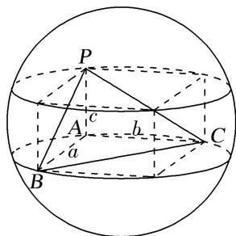
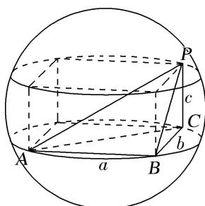
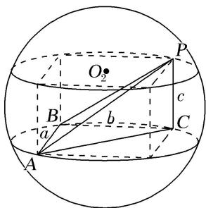
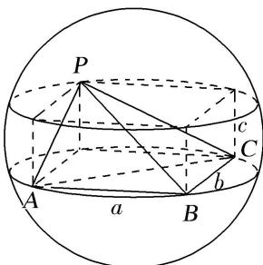
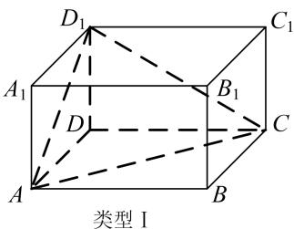
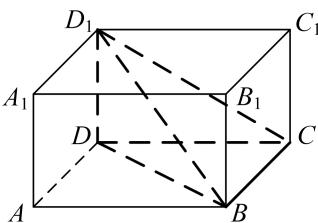
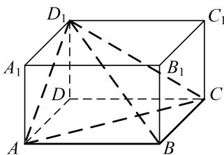

<!-- question-source:start -->
1. 墙角模型；2. 对棱相等模型；3. 汉堡模型；4. 垂面模型；5. 切瓜模型；6. 斗笠模型；7. 鳄鱼模型；8. 已知球心或球半径模型；9. 最值模型；10. 内切球模型。

## 【方法总结】

墙角模型是三棱锥有一条侧棱垂直于底面且底面是直角三角形模型，用构造法(构造长方体)解决．外接球的直径等于长方体的体对角线长(在长方体的同一顶点的三条棱长分别为a，b，c，外接球的半径为R，则 $2R=\sqrt{a^{2}+b^{2}+c^{2}}$ ．)，秒杀公式： $R^{2}=\frac{a^{2}+b^{2}+c^{2}}{4}$ ．可求出球的半径从而解决问题．有以下四种类型：

  
类型Ⅱ

  
类型III

例外型  
  
【例题选讲】

[例] (1)已知三棱锥 $A - BCD$ 的四个顶点 $A, B, C, D$ 都在球 $O$ 的表面上， $AC \perp$ 平面 $BCD, BC \perp CD$ 且 $AC = \sqrt{3}, BC = 2, CD = \sqrt{5}$ ，则球 $O$ 的表面积为（）A. $12\pi$ B. $7\pi$ C. $9\pi$ D. $8\pi$
<!-- question-source:end -->

![[高中/总复习/专题/几何体的外接球与内切球10大模型/专题1 墙角模型-几何体的外接球与内切球10大模型/专题1_墙角模型_几何体的外接球与内切球10大模型/对点训练/answers/Q00039934A1.md]]
