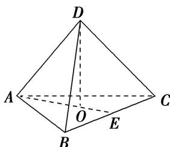
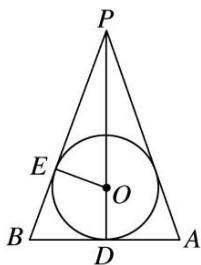
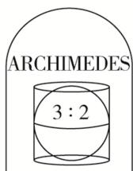
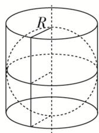
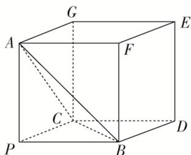

<!-- source-part:1 pages:1-6 -->

## 专题十 内切球模型

## 【方法总结】

以三棱锥 P-ABC 为例，求其内切球的半径.

方法：等体积法，三棱锥 P-ABC 体积等于内切球球心与四个面构成的四个三棱锥的体积之和；

第一步：先求出四个表面的面积和整个锥体体积；

第二步：设内切球的半径为 r，球心为 O，建立等式： $V_{P-ABC}=V_{O-ABC}+V_{O-PAB}+V_{O-PAC}+V_{O-PBC}\Rightarrow V_{P-ABC}=\frac{1}{3}S_{\triangle ABC}\cdot r+\frac{1}{3}S_{\triangle PAB}\cdot r+\frac{1}{3}S_{\triangle PAC}\cdot r+\frac{1}{3}S_{\triangle PBC}\cdot r=\frac{1}{3}(S_{\triangle ABC}+S_{\triangle PAB}+S_{\triangle PAC}+S_{\triangle PBC})\cdot r;$

第三步：解出 $r = \frac{3V_{P - ABC}}{S_{O - ABC} + S_{O - PAB} + S_{O - PAC} + S_{O - PBC}} = \frac{3V}{S_{\text{表}}}.$

秒杀公式(万能公式): $r=\frac{3V}{S_{表}}$

【例题选讲】

[例]
(1)已知一个三棱锥的所有棱长均为 $\sqrt{2}$ ，则该三棱锥的内切球的体积为 \_\_\_\_.

答案 $\frac{\sqrt{3}}{54}\pi$ 解析 由题意可知，该三棱锥为正四面体，如图所示. $AE = AB\cdot \sin 60^{\circ} = \frac{\sqrt{6}}{2}, AO = \frac{2}{3} AE = \frac{\sqrt{6}}{3}, DO = \sqrt{AD^{2} - AO^{2}} = \frac{2\sqrt{3}}{3}$ ，三棱锥的体积 $V_{D - ABC} = \frac{1}{3} S_{\triangle ABC}\cdot DO = \frac{1}{3}$ ，设内切球的半径为 $r$ ，则 $V_{D - ABC} = \frac{1}{3} r(S_{\triangle ABC} + S_{\triangle ABD} + S_{\triangle BCD} + S_{\triangle ACD}) = \frac{1}{3}, r = \frac{\sqrt{3}}{6}, V_{\text{内切球}} = \frac{4}{3}\pi r^{3} = \frac{\sqrt{3}}{54}\pi.$

(2)(2020·全国III)已知圆锥的底面半径为1，母线长为3，则该圆锥内半径最大的球的体积为\_\_\_\_.

答案 $\frac{\sqrt{2}}{3}\pi$ 解析 圆锥内半径最大的球即为圆锥的内切球，设其半径为r．作出圆锥的轴截面PAB，如图所示，则△PAB的内切圆为圆锥的内切球的大圆．在△PAB中，PA=PB=3，D为AB的中点，AB=2，E为切点，则 $PD=2\sqrt{2}$ ，△PEO∽△PDB，故 $\frac{PO}{PB}=\frac{OE}{DB}$ ，即 $\frac{2\sqrt{2}-r}{3}=\frac{r}{1}$ ，解得 $r=\frac{\sqrt{2}}{2}$ ，故内切球的体积为 $\frac{4\pi}{3}\left(\frac{\sqrt{2}}{2}\right)^{3}=\frac{\sqrt{2}}{3}\pi$ .

(3)阿基米德(公元前287年～公元前212年)是古希腊伟大的哲学家、数学家和物理学家，他和高斯、牛顿并列被称为世界三大数学家．据说，他自己觉得最为满意的一个数学发现就是“圆柱内切球体的体积是圆柱体积的三分之二，并且球的表面积也是圆柱表面积的三分之二”．他特别喜欢这个结论．要求后人在他的墓碑上刻着一个圆柱容器里放了一个球，如图，该球顶天立地，四周碰边．若表面积为 $54\pi$ 的圆柱的底面直径与高都等于球的直径，则该球的体积为( )

A. $4\pi$ B. $16\pi$ C. $36\pi$ D. $\frac{64\pi}{3}$

答案 C 解析 设该圆柱的底面半径为 R，则圆柱的高为 2R，则圆柱的表面积 $S = S_{底} + S_{侧} = 2 \times \pi R^{2} + 2 \cdot \pi \cdot R \cdot 2R = 54\pi$ ，解得 $R^{2} = 9$ ，即 R = 3。∴ 圆柱的体积为 $V = \pi R^{2} \times 2R = 54\pi$ ，∴ 该圆柱的内切球的体积为 $\frac{2}{3} \times 54\pi = 36\pi$ 。故选 C。

(4)已知三棱锥 $P - ABC$ 的三条侧棱 $PA, PB, PC$ 两两互相垂直，且 $PA = PB = PC = 2$ ，则三棱锥 $P - ABC$ 的外接球与内切球的半径比为

答案 $\frac{3\sqrt{3} + 3}{2}$ 解析 以 $PA, PB, PC$ 为过同一顶点的三条棱，作长方体，由 $PA = PB = PC = 2$ ，可知此长方体即为正方体．设外接球的半径为 $R$ ，则 $R = \frac{\sqrt{4 + 4 + 4}}{2} = \sqrt{3}$ ，设内切球的半径为 $r$ ，则内切球的球心到四个面的距离均为 $r$ ，由 $\frac{1}{3} (S_{\triangle ACP} + S_{\triangle APB} + S_{\triangle PCB} + S_{\triangle ABC})\cdot r = \frac{1}{3}\cdot S_{\triangle PCB}\cdot AP$ ，解得 $r = \frac{2}{3 + \sqrt{3}}$ ，所以 $\frac{R}{r} = \frac{\frac{\sqrt{3}}{2}}{\frac{2}{3 + \sqrt{3}}} = \frac{3\sqrt{3} + 3}{2}$

(5)正四面体的外接球和内切球上各有一个动点 $P$ 、 $Q$ ，若线段 $PQ$ 长度的最大值为 $\frac{4}{3}\sqrt{6}$ ，则这个四面体的棱长为\_\_\_\_.

答案 4 解析 设这个四面体的棱长为 a，则它的外接球与内切球的球心重合，且半径 $R_{外}=\frac{\sqrt{6}}{4}a$

$r_{内}=\frac{\sqrt{6}}{12}a$ ，依题意得 $\frac{\sqrt{6}}{4}a+\frac{\sqrt{6}}{12}a=\frac{4\sqrt{6}}{3}$ ，∴a=4。

## 【对点训练】

![[高中/总复习/专题/几何体的外接球与内切球10大模型/专题10 内切球模型-几何体的外接球与内切球10大模型/专题10_内切球模型/对点训练/Q00039945.md]]
![[高中/总复习/专题/几何体的外接球与内切球10大模型/专题10 内切球模型-几何体的外接球与内切球10大模型/专题10_内切球模型/对点训练/Q00039946.md]]
![[高中/总复习/专题/几何体的外接球与内切球10大模型/专题10 内切球模型-几何体的外接球与内切球10大模型/专题10_内切球模型/对点训练/Q00039947.md]]
![[高中/总复习/专题/几何体的外接球与内切球10大模型/专题10 内切球模型-几何体的外接球与内切球10大模型/专题10_内切球模型/对点训练/Q00039948.md]]
![[高中/总复习/专题/几何体的外接球与内切球10大模型/专题10 内切球模型-几何体的外接球与内切球10大模型/专题10_内切球模型/对点训练/Q00039949.md]]
![[高中/总复习/专题/几何体的外接球与内切球10大模型/专题10 内切球模型-几何体的外接球与内切球10大模型/专题10_内切球模型/对点训练/Q00039950.md]]
![[高中/总复习/专题/几何体的外接球与内切球10大模型/专题10 内切球模型-几何体的外接球与内切球10大模型/专题10_内切球模型/对点训练/Q00039951.md]]
![[高中/总复习/专题/几何体的外接球与内切球10大模型/专题10 内切球模型-几何体的外接球与内切球10大模型/专题10_内切球模型/对点训练/Q00039952.md]]
![[高中/总复习/专题/几何体的外接球与内切球10大模型/专题10 内切球模型-几何体的外接球与内切球10大模型/专题10_内切球模型/对点训练/Q00039953.md]]
![[高中/总复习/专题/几何体的外接球与内切球10大模型/专题10 内切球模型-几何体的外接球与内切球10大模型/专题10_内切球模型/对点训练/Q00039954.md]]
