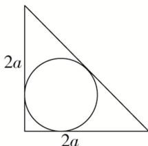

> [!faq]- 《专题10 内切球模型-几何体的外接球与内切球10大模型》例题解析
>
> > [!success]- **【答案】** 详见解析
>
> > [!note]- **【分析】**
> > 本题未单列分析。
>
> > [!note]- **【解析】**
> > 答案 $(2 - \sqrt{2})a$ 解析 解法一：由题意知，球内切于四棱锥 $P - ABCD$ 时半径最大，设该四棱锥的内切球的球心为 $O$ ，半径为 $r$ ，连接 $OA, OB, OC, OD, OP$ ，则 $V_{P - ABCD} = V_{O - ABCD} + V_{O - PAD} + V_{O - PAB} + V_{O - PBC} + V_{O - PCD}$ ，即 $\frac{1}{3} \times 2a \times 2a \times 2a = \frac{1}{3} \times \left[4a^2 + 2 \times \frac{1}{2} \times 2a \times 2a + 2 \times \frac{1}{2} \times 2a \times 2\sqrt{2} a\right] \times r$ ，解得 $r = (2 - \sqrt{2})a$ 解法二：易知当球内切于四棱锥 $P - ABCD$ ，即与四棱锥 $P - ABCD$ 各个面均相切时，球的半径最大，作出相切时的侧视图如图所示，设四棱锥 $P - ABCD$ 内切球的半径为 $r$ ，则
> >
> > 
> >
> > $\frac{1}{2} \times 2a \times 2a = \frac{1}{2} \times (2a + 2a + 2\sqrt{2}a) \times r$ ，解得 $r = (2 - \sqrt{2})a$ .
